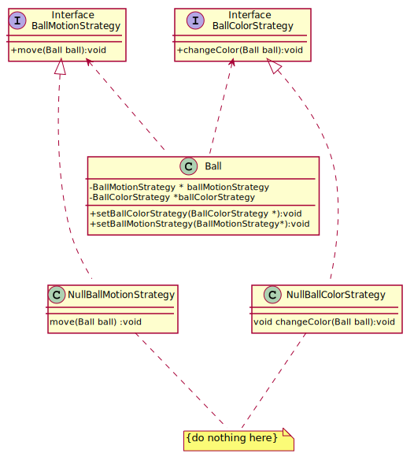
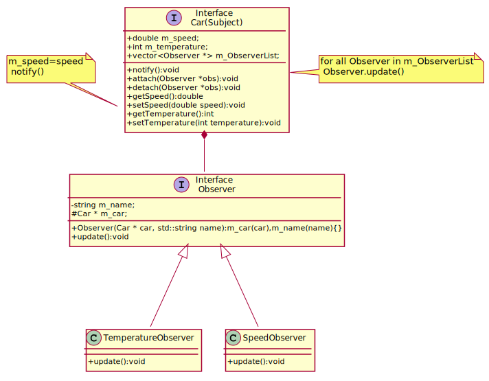
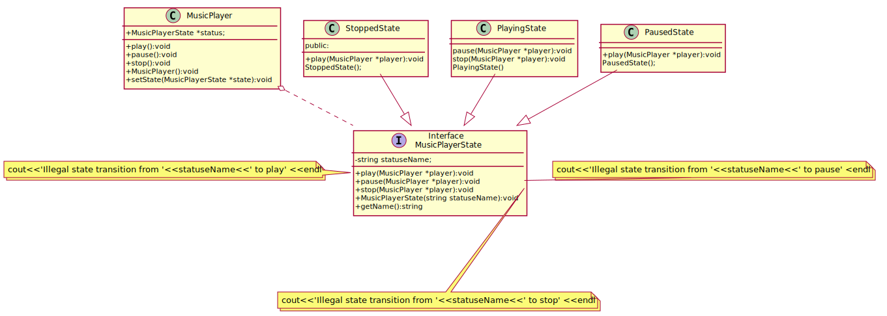
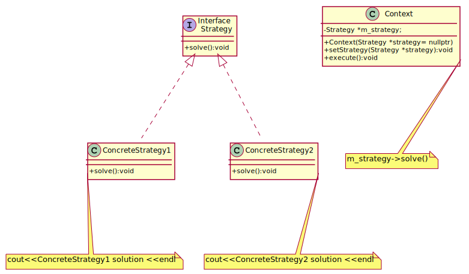

# Behavioral Patterns
- [Chain Of Responsibility](#chain-of-responsibility)
- [Command](#command)
- [Interpreter](#interpreter)
- [Iterator](#iterator)
- [Mediator](#mediator)
- [Memento](#memento)
- [NullObject](#nullobject)
- [Observer](#observer)
- [State](#state)
- [Strategy](#strategy)
- [Template Method](#template-method)
- [Visitor](#visitor)

## Chain Of Responsibility
There is a potentially variable number of "handler" or "processing element" or "node" objects, and a stream of requests that must be handled. Need to efficiently process the requests without hard-wiring handler relationships and precedence, or request-to-handler mappings.

The chain-of-responsibility pattern is structurally nearly identical to the decorator pattern, the difference being that for the decorator, all classes handle the request, while for the chain of responsibility, exactly one of the classes in the chain handles the request. This is a strict definition of the Responsibility concept in the GoF book. However, many implementations (such as loggers below, or UI event handling, or servlet filters in Java, etc) allow several elements in the chain to take responsibility.

[plantuml code](diagrams/chain_of_responsibility.puml)

Chain of Responsibility, Command, Mediator, and Observer, address how you can decouple senders and receivers, but with different trade-offs. Chain of Responsibility passes a sender request along a chain of potential receivers.
Chain of Responsibility can use Command to represent requests as objects.
Chain of Responsibility is often applied in conjunction with Composite. There, a component's parent can act as its successor.

Source code examples: 
[photo processor](ChainOfResponsibility/photo_processor.cpp), [chain of responsibility handler](ChainOfResponsibility/chain_of_responsibility_handler.cpp)

## Command
Command is a behavioral design pattern that turns a request into a stand-alone object that contains all information about the request. This transformation lets you parameterize methods with different requests, delay or queue a request’s execution, and support undoable operations.

The Invoker object calls execute() on a Command1 object. Command1 calls action1() on a Receiver1 object, which performs the request.

[plantuml code](diagrams/command.puml)

Source code examples:
[Light on command](Command/LightOnCommand.cpp), [giant command](Command/giant_command.cpp)

## Interpreter

Source code examples:
## Iterator
Iterator is a behavioral design pattern that lets you traverse elements of a collection without exposing its underlying representation (list, stack, tree, etc.).

Source code examples:
[iterator](Iterator/iterator.cpp), [notification iterator](Iterator/notification_iterator.cpp), [stack iterator](Iterator/stack_iterator.cpp)

## Mediator
Tight coupling between a set of interacting objects should be avoided. It should be possible to change the interaction between a set of objects independently. Mediator design pattern defines a separate (mediator) object that encapsulates the interaction between a set of objects.
Objects delegate their interaction to a mediator object instead of interacting with each other directly.
As to overcome the limitation of the Observer Design Pattern which works in a one-to-many relationship, Mediator Design Pattern can be employed for a many-to-many relationship.

[plantuml code](diagrams/chat_mediator.puml)

Source code examples:
[chat room mediator](Mediator/chat_room_mediator.cpp), [airport mediator traffic pattern](Mediator/airport_mediator_traffic_pattern.cpp), [mediator before after](Mediator/mediator_before_after.cpp)

## Memento

Memento is a behavioral design pattern that lets you save and restore the previous state of an object without revealing the details of its implementation.

[plantuml code](diagrams/notepad_memento.puml)

You can use **Command** and **Memento** together when implementing “undo”. In this case, commands are responsible for performing various operations over a target object, while mementos save the state of that object just before a command gets executed.

You can use **Memento** along with **Iterator** to capture the current iteration state and roll it back if necessary.

Sometimes **Prototype** can be a simpler alternative to Memento. This works if the object, the state of which you want to store in the history, is fairly straightforward and doesn’t have links to external resources, or the links are easy to re-establish.

Source code examples:
[notepad memento](Memento/notepad_memento.cpp)

## NullObject
Sometimes a class that requires a collaborator does not need the collaborator to do anything. A null object is an object with no referenced value or with defined neutral ("null") behavior. The null object design pattern describes the uses of such objects and their behavior. Instead of using a null reference (nullptr in C++) to convey absence of an object (for instance, 
a non-existent customer), one uses an object which implements the expected interface, but whose method body is empty. 
The advantage of this approach over a working default implementation is that a null object is very predictable and has no side effects: 
it does nothing.

Consider for example a simple screen saver which displays balls that move about the screen and have special color effects. This is easily achieved by creating a Ball class to represent the balls and using a Strategy pattern [GHJV95, page 315] to control the ball's motion and another Strategy pattern to control the ball's color.

Here, the idea is that there are situations where a pointer or reference to an Animal object is required, but there is no appropriate object available. A null reference is impossible in standard-conforming C++. A null Animal* pointer is possible, and could be useful as a place-holder, but may not be used for direct dispatch: a->MakeSound() is undefined behavior if a is a null pointer.

The null object pattern solves this problem by providing a special NullAnimal class which can be instantiated bound to an Animal pointer or reference.

[plantuml code](diagrams/ball_null_object.puml)

Source code examples:
[animal null object](NullObject/animal_null_object.cpp), [binary tree null object](NullObject/binary_tree_null_object.cpp),[ball_screen_saver_null_object](NullObject/ball_screen_saver_null_object.cpp)

## Observer
Define **Subject** and **Observer** objects, so that when a subject changes state, all registered observers are notified and updated automatically
 (and probably asynchronously). Observer is the "View" part of Model-View-Controller.

[plantuml code](diagrams/observer.puml)

Source code examples:
[car parts observer](Observer/car_observer.cpp), [clocktimer](Observer/clocktimer.cpp), [rocket observer](Observer/rocket_observer.cpp), , , [weather station observer](Observer/weather_station_observer.cpp), [chat room observer](Observer/chat_room_observer.cpp)

## State

State pattern allows an object to alter its behavior when its internal state changes. This pattern is close to the concept of finite-state machines.
The state pattern can be interpreted as a strategy pattern, which is able to switch a strategy through invocations of methods defined in the
 pattern's interface.

[plantuml code](diagrams/music_player_state.puml)

Source code examples:
[music player state](State/music_player_state.cpp), [machine on off state](State/machine_on_off_state.cpp) 

## Strategy

Strategy design pattern enables selecting an algorithm at runtime. Instead of implementing a single algorithm directly, code receives 
run-time instructions as to which in a family of algorithms to use.

[plantuml code](diagrams/conceptual_strategy.puml)

Source code examples:
[robot strategy](Strategy/robot.cpp), [conceptual strategy](Strategy/conceptual_strategy.cpp), [billing strategy](Strategy/billing_strategy.cpp)

## Template Method

The Template Method defines a skeleton of an algorithm in an operation, and defers some steps to subclasses. Template Method lets subclasses redefine certain steps of that algorithm without changing the algorithm's structure.

[plantuml code](diagrams/order_process_template.puml)

**Strategy** is like Template Method except in its granularity.
Template Method uses inheritance to vary part of an algorithm. **Strategy** uses delegation to vary the entire algorithm.
Strategy modifies the logic of individual objects. Template Method modifies the logic of an entire class.
**Factory Method** is a specialization of Template Method.

Source code examples:
[template method](TemplateMethod/template_method.cpp), [template method order](TemplateMethod/template_method_order.cpp)

## Visitor
Visitor design pattern is a way of separating an algorithm from an object structure on which it operates. A practical result of this separation
 is the ability to add new operations to existing object structures without modifying the structures. 
It is one way to follow the open/closed principle.
Visitor design pattern make it possible to define a new operation for (some) classes of an object structure without changing the classes.
Visitor implements "double dispatch"

[plantuml code](diagrams/car_visitor.puml)

Source code examples: [car visitor](Visitor/car_visitor.cpp), [color visitor](Visitor/color_visitor.cpp), [shopping item_visitor](Visitor/shopping_item_visitor.cpp), [document visitor](Visitor/document_visitor.cpp), [file visitor](Visitor/file_visitor.cpp), [stock visitor](Visitor/stock_visitor.cpp), [expression printer](Visitor/expression_printer.cpp)
