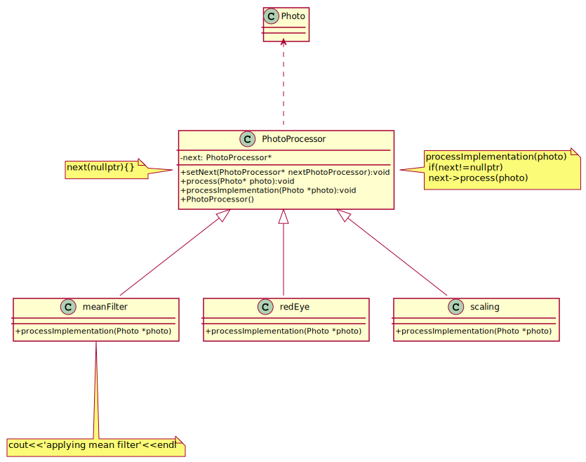
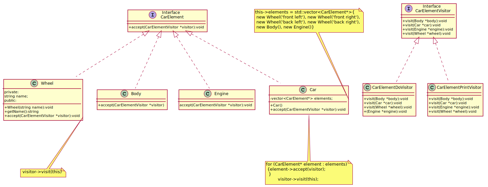

# Behavioral Patterns
- [Chain Of Responsibility](#chain-of-responsibility)
- [Command](#command)
- [Interpreter](#interpreter)
- [Iterator](#iterator)
- [Mediator](#mediator)
- [Memento](#memento)
- [NullObject](#nullobject)
- [Observer](#observer)
- [State](#state)
- [Strategy](#strategy)
- [Template Method](#template-method)
- [Visitor](#visitor)
## Chain Of Responsibility
There is a potentially variable number of "handler" or "processing element" or "node" objects, and a stream of requests that must be handled. Need to efficiently process the requests without hard-wiring handler relationships and precedence, or request-to-handler mappings.

The chain-of-responsibility pattern is structurally nearly identical to the decorator pattern, the difference being that for the decorator, all classes handle the request, while for the chain of responsibility, exactly one of the classes in the chain handles the request. This is a strict definition of the Responsibility concept in the GoF book. However, many implementations (such as loggers below, or UI event handling, or servlet filters in Java, etc) allow several elements in the chain to take responsibility.

[plantuml code](diagrams/chain_of_responsibility.puml)

Chain of Responsibility, Command, Mediator, and Observer, address how you can decouple senders and receivers, but with different trade-offs. Chain of Responsibility passes a sender request along a chain of potential receivers.
Chain of Responsibility can use Command to represent requests as objects.
Chain of Responsibility is often applied in conjunction with Composite. There, a component's parent can act as its successor.

Source code examples: 
[photo processor](ChainOfResponsibility/photo_processor.cpp), [chain of responsibility handler](ChainOfResponsibility/chain_of_responsibility_handler.cpp)

## Command
Command is a behavioral design pattern that turns a request into a stand-alone object that contains all information about the request. This transformation lets you parameterize methods with different requests, delay or queue a request’s execution, and support undoable operations.

The Invoker object calls execute() on a Command1 object. Command1 calls action1() on a Receiver1 object, which performs the request.

[plantuml code](diagrams/command.puml)

Source code examples:
[Light on command](Command/LightOnCommand.cpp), [giant command](Command/giant_command.cpp)

## Interpreter

Source code examples:
## Iterator
Iterator is a behavioral design pattern that lets you traverse elements of a collection without exposing its underlying representation (list, stack, tree, etc.).

Source code examples:
[iterator](Iterator/iterator.cpp), [notification iterator](Iterator/notification_iterator.cpp), [stack iterator](Iterator/stack_iterator.cpp)

## Mediator
As to overcome the limitation of the Observer Design Pattern which works in a one-to-many relationship, Mediator Design Pattern can be employed for a many-to-many relationship.

Source code examples:
[chat room mediator](Mediator/chat_room_mediator.cpp), [airport mediator traffic pattern](Mediator/airport_mediator_traffic_pattern.cpp), [mediator before after](Mediator/mediator_before_after.cpp)

## Memento
Source code examples:
[notepad memento](Memento/notepad_memento.cpp)

## NullObject

Source code examples:
[null object](NullObject/null_object.cpp)

## Observer
Defines a a one to many dependency between objects so that when one object state changes, 
all of its dependencies are noified and updated automatically

Source code examples:
[car parts observer](Observer/car_observer.cpp), [clocktimer](Observer/clocktimer.cpp), [rocket observer](Observer/rocket_observer.cpp), , , [weather station observer](Observer/weather_station_observer.cpp), [chat room observer](Observer/chat_room_observer.cpp)

## State

Source code examples:
[music player state](State/music_player_state.cpp), [machine on off state](State/machine_on_off_state.cpp) 

## Strategy

Source code examples:
[robot strategy](Strategy/robot.cpp), [conceptual strategy](Strategy/conceptual_strategy.cpp), [billing strategy](Strategy/billing_strategy.cpp)

## Template Method

Source code examples:
[template method](TemplateMethod/template_method.cpp), [template method order](TemplateMethod/template_method_order.cpp)

## Visitor
Visitor design pattern is a way of separating an algorithm from an object structure on which it operates. A practical result of this separation
 is the ability to add new operations to existing object structures without modifying the structures. 
It is one way to follow the open/closed principle.
Visitor design pattern make it possible to define a new operation for (some) classes of an object structure without changing the classes.
Visitor implements "double dispatch"

[plantuml code](diagrams/car_visitor.puml)

Source code examples: [car visitor](Visitor/car_visitor.cpp), [color visitor](Visitor/color_visitor.cpp), [shopping item_visitor](Visitor/shopping_item_visitor.cpp), [document visitor](Visitor/document_visitor.cpp), [file visitor](Visitor/file_visitor.cpp), [stock visitor](Visitor/stock_visitor.cpp), [expression printer](Visitor/expression_printer.cpp)
