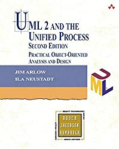
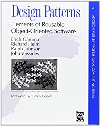
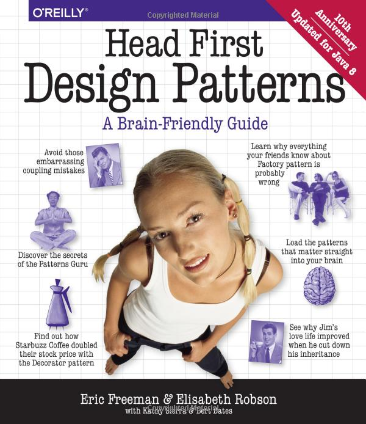
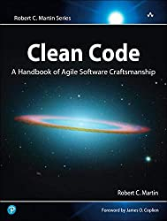

# [UML, Design Pattern and Refactoring](#)

This repository serves as a comprehensive resource for learning software design and development with C++. It includes:

- **UML Diagrams**: Explore concepts and detailed examples of various UML diagrams, including structure diagrams (e.g., Class, Component, Deployment) and behavioral diagrams (e.g., Use Case, Sequence, State Machine).  
- **Design Patterns**: A collection of examples for behavioral, creational, and structural design patterns, showcasing best practices in object-oriented programming.  
- **Software Design Principles**: Illustrations of SOLID principles, the Rule of Three/Five/Zero, and other foundational concepts for robust software architecture.  
- **Refactoring Techniques**: Guidance on identifying bad code smells and applying refactoring methods to improve code quality and maintainability.  
- **Architectural Patterns**: Insights into high-level software architecture patterns such as MVC, Microservices, and Event-Driven Architecture.  
- **SDLC Models**: Overviews of popular software development lifecycle models like Waterfall, Agile, and DevOps.

This repository is enriched with C++ examples, references, and visual aids to help developers, architects, and students better understand and implement professional-grade software design.

---
### How to build on your machine 
configure it:

```
cmake -G "Ninja Multi-Config"  -S . -B build
```

build it:

```
cmake --build build --config Release
```

or 

```
cmake --build build --config Debug
```

or be more specific:

```
cmake --build build --target all --config Release
```

If you prefer `preset` use:

```
cmake --preset ninja-multi
```
and 

```
cmake --build --preset ninja-multi-debug
```
or 
```
cmake --build --preset ninja-multi-release
```

---
## [UML](#) 
- [UML Diagram Maker Tools](docs/UML/Concepts/README.md) 
- [Concepts](docs/UML/Concepts) 
- [Structure Diagrams](docs/UML/StructureDiagrams/)
   * [Class Diagram](docs/UML/StructureDiagrams/ClassDiagram/README.md)
   * [Component Diagram](docs/UML/StructureDiagrams/ComponentDiagram)
   * [Deployment Diagram](docs/UML/StructureDiagrams/DeploymentDiagram)
   * [Object Diagram](docs/UML/StructureDiagrams/ObjectDiagram)
   * [Package Diagram](docs/UML/StructureDiagrams/PackageDiagram)
   * [Profile Diagram](docs/UML/StructureDiagrams/ProfileDiagram)
   * [Composite Structure Diagram](UML/StructureDiagrams/CompositeStructureDiagram)
- [Behavioral Diagrams](docs/UML/BehavioralDiagrams)
   * [Use Case Diagram](docs/UML/BehavioralDiagrams/UseCaseDiagram)
   * [Activity Diagram](docs/UML/BehavioralDiagrams/ActivityDiagram)
   * [State Machine Diagram](docs/UML/BehavioralDiagrams/StateMachineDiagram)
   * [Sequence Diagram](docs/UML/BehavioralDiagrams/SequenceDiagram)
   * [Communication Diagram](docs/UML/BehavioralDiagrams/CommunicationDiagram)
   * [Interaction Overview Diagram](docs/UML/BehavioralDiagrams/InteractionOverviewDiagram)
   * [Timing Diagram](docs/UML/BehavioralDiagrams/TimingDiagram)
- [Extensibility](docs/UML/Extensibility)


ASCII codes and UML diagrams:
	[1](http://www.plantuml.com/plantuml/umla/),
	[2](https://www.alt-codes.net/), 
	[3](https://yaytext.com/)

References:
	[1](https://cppcodetips.wordpress.com/2013/12/23/uml-class-diagram-explained-with-c-samples/), 
	[2](https://www.learncpp.com/cpp-tutorial/10-1-object-relationships/), 
	[3](https://www.wikiwand.com/en/Class_diagram),
	[4](https://www.uml-diagrams.org/),
	[5](https://www.visual-paradigm.com/guide/uml-unified-modeling-language/uml-class-diagram-tutorial/),
	[6](https://www.ibm.com/support/knowledgecenter/SS8PJ7_9.7.0/com.ibm.xtools.modeler.doc/topics/cdepend.html)
	[7](http://www.cs.sjsu.edu/~pearce/modules/lectures/oop/basics/interfaces.htm)
	[8](https://martinfowler.com/bliki/BallAndSocket.html)

    
|   |   |   |
|---|---|---|
|<a target="_blank"  href="https://www.amazon.com/gp/product/0596009828/ref=as_li_tl?ie=UTF8&camp=1789&creative=9325&creativeASIN=0596009828&linkCode=as2&tag=rosdev09-20&linkId=2690ec967b66a97892f0dc164b3451cb"></a>|<a target="_blank"  href="https://www.amazon.com/gp/product/0321321278/ref=as_li_tl?ie=UTF8&camp=1789&creative=9325&creativeASIN=0321321278&linkCode=as2&tag=rosdev09-20&linkId=daa19c0aab2d0a02aa6877635026ccc3"></a>|<a target="_blank"  href="https://www.amazon.com/gp/product/0321193687/ref=as_li_tl?ie=UTF8&camp=1789&creative=9325&creativeASIN=0321193687&linkCode=as2&tag=rosdev09-20&linkId=657a0bf853a4191b25a2d6a8d8c44d95"></a>


## [SOLID Design Principles](SOLID)  
- [Single responsibility principle](SOLID/SingleResponsibilityPrinciple)  
- [Open–closed principle](SOLID/OpenClosedPrinciple)  
- [Liskov substitution principle](SOLID/LiskovSubstitutionPrinciple)  
- [Interface segregation principle](SOLID/InterfaceSegregationPrinciple)  
- [Dependency inversion principle](SOLID/DependencyInjection)  

## [Rule Of Three/Five/Zero](RuleOfThreeFiveZero)
- [Rule Of Five](RuleOfThreeFiveZero/src/rule_of_five.cpp)  
- [Rule Of Three](RuleOfThreeFiveZero/src/rule_of_three.cpp)  
- [Rule Of Zero](RuleOfThreeFiveZero/src/rule_of_zero.cpp)  

## [Software DesignPatern](#) 
- [Behavioral patterns](docs/DesignPatern/Behavioral/README.md)
  * [Chain of responsibility](docs/DesignPatern/Behavioral/ChainOfResponsibility.md)  
  * [Command](docs/DesignPatern/Behavioral/Command.md)  
  * [Interpreter](docs/DesignPatern/Behavioral/Interpreter.md)  
  * [Iterator](docs/DesignPatern/Behavioral/Iterator.dm)  
  * [Mediator](docs/DesignPatern/Behavioral/Mediator.md)  
  * [Memento](docs/DesignPatern/Behavioral/Memento.md)  
  * [Null Object](docs/DesignPatern/Behavioral/NullObject.md)  
  * [Observer](docs/DesignPatern/Behavioral/Observer.md)  
  * [State](docs/DesignPatern/Behavioral/State.md)  
  * [Strategy](docs/DesignPatern/Behavioral/Strategy.md)  
  * [Template method](docs/DesignPatern/Behavioral/TemplateMethod.md)  
  * [Visitor](docs/DesignPatern/Behavioral/Visitor.md)  
- [Creational patterns](docs/DesignPatern/Creational/README.md)
  * [Abstract Factory](docs/DesignPatern/Creational/AbstractFactoryMethod.md)  
  * [Builder](docs/DesignPatern/Creational/Builder.md)  
  * [Factory Method](docs/DesignPatern/Creational/FactoryMethod.md)  
  * [Object Pool](docs/DesignPatern/Creational/ObjectPool.md)  
  * [Prototype](docs/DesignPatern/Creational/Prototype.md)  
  * [Singleton](docs/DesignPatern/Creational/Singleton.md)  
- [Structural patterns](docs/DesignPatern/Structural/README.md)
  * [Adapter](docs/DesignPatern/Structural/Adapter.md)  
  * [Bridge](docs/DesignPatern/Structural/Bridge.md)  
  * [Composite](docs/DesignPatern/Structural/Composite.md)  
  * [Decorator](docs/DesignPatern/Structural/Decorator.md)  
  * [Facade](docs/DesignPatern/Structural/Facade.md)  
  * [Flyweight](docs/DesignPatern/Structural/Flyweight.md)  
  * [Private Class Data](docs/DesignPatern/Structural/PrivateClassData.md)  
  * [Proxy](docs/DesignPatern/Structural/Proxy.md)  

## [Software Architectural Patterns](#)
- [Model View Controller](SoftwareArchitecturalPatterns/ModelViewController/src/student_model_view_controller.cpp)
- [Entity Component System](SoftwareArchitecturalPatterns/EntityComponentSystem/README.md)
- [Master-slave Architecture](SoftwareArchitecturalPatterns/#)
- [Microservices Architecture](SoftwareArchitecturalPatterns/#)
- [Microkernel Pattern](SoftwareArchitecturalPatterns/#)
- [Event-driven Architecture](SoftwareArchitecturalPatterns/#)
- [Client-server Architectur](SoftwareArchitecturalPatterns/#)


References:
	[1](https://en.wikibooks.org/wiki/C%2B%2B_Programming/Code/Design_Patterns), 
	[2](https://sourcemaking.com/design_patterns/),
	[3](https://refactoring.guru/), 
	[4](https://cpppatterns.com/), 
	[5](https://www.youtube.com/playlist?list=PLrhzvIcii6GNjpARdnO4ueTUAVR9eMBpc),
	[6](https://www.bogotobogo.com/DesignPatterns/),
	[7](https://www.growingwiththeweb.com/p/explore.html?t=Design%20pattern),
	[8](https://www.tutorialspoint.com/design_pattern/),
	[9](http://simpletechtalks.com/tag/design-patterns/),
	[10](http://www.vishalchovatiya.com/iterator-design-pattern-in-modern-cpp/),
	[11](https://cppcodetips.wordpress.com/category/design-pattern/),
	[12](https://caiorss.github.io/C-Cpp-Notes/cpp-design-patterns.html),
	[13](https://readthedocs.org/projects/cpp-design-patterns/downloads/pdf/latest/)

|   |   |   |
|---|---|---|
|<a target="_blank"  href="https://www.amazon.com/gp/product/0201633612/ref=as_li_tl?ie=UTF8&camp=1789&creative=9325&creativeASIN=0201633612&linkCode=as2&tag=rosdev09-20&linkId=175fc3c33d5c7f359af5401c1250f192"></a>|<a target="_blank"  href="https://www.amazon.com/gp/product/0596007124/ref=as_li_tl?ie=UTF8&camp=1789&creative=9325&creativeASIN=0596007124&linkCode=as2&tag=rosdev09-20&linkId=76b4256e75432f557909a43e0a9de1a2"></a>|<a target="_blank"  href="https://www.amazon.com/gp/product/1484236025/ref=as_li_tl?ie=UTF8&camp=1789&creative=9325&creativeASIN=1484236025&linkCode=as2&tag=rosdev09-20&linkId=974576fff321c67154d6bc7299956ef0"></a>|

## [Refactoring](#) 
- [Bad Code Smells](Refactoring/BadCodeSmells)
  * [Bloaters](Refactoring/BadCodeSmells/Bloaters)
  * [ChangePreventers](Refactoring/BadCodeSmells/ChangePreventers)
  * [Couplers](Refactoring/BadCodeSmells/Couplers)
  * [Dispensables](Refactoring/BadCodeSmells/Dispensables)
  * [Object-Orientation Abusers](Refactoring/BadCodeSmells/Object-OrientationAbusers)
- [Refactoring Techniques](#)
  * [Composing Methods](Refactoring/RefactoringTechniques/ComposingMethods)
  * [Dealing With Generalisation](Refactoring/RefactoringTechniques/DealingWithGeneralisation)
  * [Moving Features Between Objects](Refactoring/RefactoringTechniques/MovingFeaturesBetweenObjects)
  * [Organizing Data](Refactoring/RefactoringTechniques/OrganizingData)
  * [Simplifying Conditional Expressions](Refactoring/RefactoringTechniques/SimplifyingConditionalExpressions)
  * [Simplifying Method Calls](Refactoring/RefactoringTechniques/SimplifyingMethodCalls)

References: [1](https://refactoring.guru/refactoring), [2](https://sourcemaking.com/refactoring), [3](https://www.refactoring.com/)

|   |   |   |
|---|---|---|
|<a target="_blank"  href="https://www.amazon.com/gp/product/0132350882/ref=as_li_tl?ie=UTF8&camp=1789&creative=9325&creativeASIN=0132350882&linkCode=as2&tag=rosdev09-20&linkId=949bad73dc39e53caf1caf849ad0f565"></a>|<a target="_blank"  href="https://www.amazon.com/gp/product/B07XGR7QQD/ref=as_li_tl?ie=UTF8&camp=1789&creative=9325&creativeASIN=B07XGR7QQD&linkCode=as2&tag=rosdev09-20&linkId=44172741182e66512df744aa85f17756"></a>|   |


## [Systems Development Life Cycle (SDLC)](#)
- [Waterfall Model](SDLC/README.md#--1-waterfall-model--)  
- [V-Model](SDLC/README.md#--2-v-model--)  
- [Agile Model](SDLC/README.md#--4-agile-model--)  
- [DevOps Model](SDLC/README.md#--9-devops-model--)  


## [System Design](#) 
- [Load Balancing](SystemDesign/index.md#1-load-balancing)
- [Caching](SystemDesign/index.md#2-caching)
- [Database Sharding](SystemDesign/index.md#3-database-sharding)
- [Replication](SystemDesign/index.md#4-replication)
- [CAP Theorem](SystemDesign/index.md#5-cap-theorem)
- [Consistent Hashing](SystemDesign/index.md#6-consistent-hashing)
- [Message Queues](SystemDesign/index.md#7-message-queues)
- [Rate Limiting](SystemDesign/index.md#8-rate-limiting)
- [API Gateway](SystemDesign/index.md#9-api-gateway)
- [Microservices](SystemDesign/index.md#10-microservices)
- [Service Discovery](SystemDesign/index.md#11-service-discovery)
- [CDNs (Content Delivery Networks)](SystemDesign/index.md#12-cdns--content-delivery-networks-)
- [DB Indexing](SystemDesign/index.md#13-db-indexing)
- [Partitioning](#14-partitioning)
- [Eventual Consistency](SystemDesign/index.md#15-eventual-consistency)
- [WebSockets](SystemDesign/index.md#16-websockets)
- [Scalability](SystemDesign/index.md#17-scalability)
- [Fault Tolerance](SystemDesign/index.md#18-fault-tolerance)
- [Monitoring](SystemDesign/index.md#19-monitoring)
- [AuthN & AuthZ](SystemDesign/index.md#20-authn---authz)


## The Flaws of Inheritance
- [The Flaws of Inheritance](docs/the_flaws_of_inheritance.md)

[](https://travis-ci.com/behnamasadi/software_engineering)


