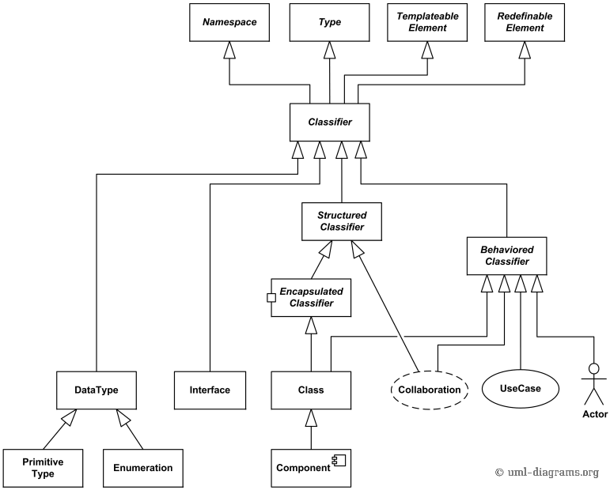

## Concepts

### Structure
#### Actor
#### Attribute
#### Artifact
#### Class
#### Component
#### Interface
#### Object
#### Package
#### Profile diagram

## Classifier
Classifier is an abstract metaclass which is the basic modeling element in UML. A classifier represents a group of 
things with common properties.
A classifier is an abstract metaclass classification concept that serves as a mechanism to 
show `interfaces`, `classes`, `datatypes` and `components`.

More formally, classifier is (extends):

- type
- templateable element
- redefinable element
- namespace

#### Types of UML Classifiers
Class
- Component
- Datatype
- Interface
- Node
- Signal
- Subsystem
- Use Case

[2](https://www.uml-diagrams.org/classifier.html)
