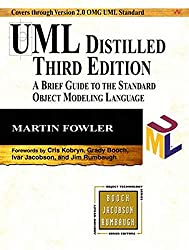

1) Structure Diagrams
  - [Class Diagram](StructureDiagrams/ClassDiagram)
  - [Component Diagram](StructureDiagrams/ComponentDiagram/)
  - Deployment Diagram
  - [Object Diagram](StructureDiagrams/ObjectDiagram)
  - [Package Diagram](StructureDiagrams/PackageDiagram)
  - [Profile Diagram](StructureDiagrams/ProfileDiagram)
  - Composite Structure Diagram
2) Behavioral Diagrams
  - Use Case Diagram
  - Activity Diagram
  - State Machine Diagram
  - [Sequence Diagram](BehavioralDiagrams/SequenceDiagram)
  - Communication Diagram
  - Interaction Overview Diagram
  - Timing Diagram

<small><i>TOC generated with <a href='http://ecotrust-canada.github.io/markdown-toc/'>markdown-toc</a></i></small>

ASCII codes:
	[1](https://www.alt-codes.net/), 
	[2](https://yaytext.com/)

Refs:   [1](https://www.uml-diagrams.org/),
	
	[.jpg)](https://www.amazon.com/gp/product/0321321278/ref=as_li_tl?ie=UTF8&camp=1789&creative=9325&creativeASIN=0321321278&linkCode=as2&tag=rosdev09-20&linkId=2c863dc1e6fe04d3b680c3801b2805e5)
