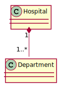

- [Class Diagram](#class-diagram)
- [Class Relationship](#class-relationship)
  * [Multiplicity in a Relation](#multiplicity-in-a-relation)
  * [Composition](#composition)
  * [Aggregation](#aggregation)
    + [Composition vs Aggregation](#composition-vs-aggregation)
    + [Summarizing composition and aggregation](#summarizing-composition-and-aggregation)
  * [Association](#association)
  * [Dependency](#dependency)
    + [Types of dependency relationships](#types-of-dependency-relationships)
  * [Inheritance (Generalization)](#inheritance--generalization-)
  * [Class template](#class-template)
- [Class Relationship in Nutshell](#class-relationship-in-nutshell)


## Class Diagram

```cpp
class Animal
{
private:
    std::string name;
protected: 
    int id;
public:
    void setName(std::string name);
    void virtual move();
    static int count();
};
```

Class diagram for the above class is shown below:


[plantuml code](diagrams/Animal.puml)


Different type of members/ methods in a class diagram
1) private members are pointed with ```-```
2) protected members are pointed with ```#``` 
3) public members are pointed with ```+```  
4) S͟t͟a͟t͟i͟c͟  members are represented as underlined.
5) 𝘗𝘶𝘳𝘦 𝘷𝘪𝘳𝘵𝘶𝘢𝘭 functions are represented as italics.


## Class Relationship
So far we only have had classes that were consist of primitive types such as int, double and string.
But a class might have relation to other classes, such as inheritance or has a member that is from type of an other class. The following summarize the relationship between classes. 
The following summarize the relationship between classes:

1) Composition (has a) ◆────────
2) Aggregation (has a) ◇────────
3) Association (knows a, Uses-a) ────────
4) Dependency (uses a) - - - - - ->
5) Inheritance (is a) ────────▷
6) Class template

### Multiplicity in a Relation
1) “0..1”               No instances, or one instance (optional, may)
2) “1”                  Exactly one instance
3) “0..* or *”          Zero or more instances
4) “1..*”               One or more instances (at least one)


### Composition
In real-life, complex objects are composed of smaller ones, i.e. a car has engine, some tires, a transmission. 
in C++ when you write a class or struct you are using basic types like int, double or other classes
when constructing a complex object which is object composition.

You can interpret or read object composition relation as ```has a```. A car ```has-a``` frame.
Composition can occur when a class is a collection or container of other classes, but where the 
contained classes have a strong life cycle dependency on the container—essentially, if the container 
is destroyed, its contents are also destroyed.


Composition relationship has the following characteristics:

1) The part is the fraction of the object.
2) The part can only belong to one object at a time.
3) The existence of the part is being managed by the object.
4) The part does not have any information about about the existence of the object.

Compositions are one of the easiest relationship types to implement in C++.
They are typically created as structs or classes with normal data members.
Because these data members exist directly as part of the struct/class, their lifetimes are bound to that
of the class instance itself. Compositions that need to do dynamic allocation or deallocation may be
implemented using pointer data members. In this case, the composition class should be responsible for
doing all necessary memory management itself (not the user of the class).

```cpp
class Point
{
};

class Circle
{
private:
    Point center;
};
```

An other example is heart and person, hear can only belong to one person and if the person dies, the heart will be deleted as well:

```
class Heart
{
};

class Person
{
private:
	Heart heart;
};
```


[plantuml code](diagrams/PersonHeart.puml)


Folder may contain many files, but each File has exactly one Folder parent. If Folder is deleted, all contained Files are deleted as well.


```cpp

class File
{
    
};
class Folder
{
public:
    vector<File> files;// 0..*; Composition
};
```


[plantuml code](diagrams/FolderFile.puml)


Hospital has 1 or more Departments, and each Department belongs to exactly one Hospital. If Hospital is closed, so are all of its Departments.
```cpp
class Departments
{

};

class Hospital
{
public:
    Hospital(int n) { departments = new Departments[n]; }
    ~Hospital(){ delete [] departments; }
    Departments *departments; // 0..*; Composition
};
```



[plantuml code](diagrams/HospitalDepartment.puml)


### Aggregation
Aggregation can occur when a class is a collection or container of other classes, but where the contained classes
do not have a strong life cycle dependency on the container—essentially, if the container is destroyed,
its contents are not. You may have confusion between aggregation and association.
Association differs from aggregation only in that it does not imply any containment.

Aggregation relationship has the following characteristics:

1) The part is the fraction of the object.
2) The part can belong to more than one object at a time.
3) The part existence does managed managed by the object.
4) The part does not have any information about about the existence of the object.

```cpp
class Proffesor
{
private:
    std::string m_name;
public:
    Proffesor(std::string name): m_name(name) { }
    std::string getName() { return m_name; }
};

class Department
{
private:
    Proffesor *m_proffesor; 
public:
    Department(Proffesor *proffesor = nullptr): m_proffesor(proffesor){}
};

```


[plantuml code](diagrams/ProffesorDepartment.puml)

A Department has a Proffesor, and the scope of Proffesor doesn’t depend on the Department. Many-to-many does not fit very well into an aggregation. Aggregation represents a part-whole relationship. It is verbalized by a "has a" verb. Thus, modeling a many-to-many relationship as an aggregation introduces a faulty design and should be expressed via association.

```cpp

Proffesor *proffesor = new Proffesor("Bob");
{
	Department dept(proffesor);
}
std::cout << proffesor->getName() << " still exists!";
delete proffesor;

```
and other implementation would be via reference variable: 
```cpp
class Proffesor
{
private:
    std::string m_name;
public:
    Proffesor(std::string name): m_name(name) { }
    std::string getName() { return m_name; }
};

class Department
{
private:
    Proffesor  m_proffesor;
public:
    Department(const Proffesor& proffesor ): m_proffesor(proffesor){}
};
```

Since the Department might have several Proffesor, if we use a vector (which makes a copy of the sent object) we will get an if we send 
a reference object (reference object can not be copied). The solution is `std::reference_wrapper`. It is a class that allows assignment and copying,
but behave like a reference

```cpp
class Proffesor
{
private:
    std::string m_name;
public:
    Proffesor(std::string name): m_name(name) { }
    std::string getName() { return m_name; }
};

class Department
{
private:
    std::vector<std::reference_wrapper<const Proffesor>>  m_proffesors;

public:

    void addProffesor(const Proffesor& proffesor )
    {
        m_proffesors.push_back(proffesor);
    }
};

    Proffesor Bob("Bob");
    Proffesor Jim("Jim");
    {
        Department dept;
        dept.addProffesor(Bob);
        dept.addProffesor(Jim);
    }
    std::cout << Bob.getName() << " still exists!";
    std::cout << Jim.getName() << " still exists!";


```

#### Composition vs Aggregation
Composition is the stronger form of aggregation. Because aggregations are similar to compositions in that they are both part-whole relationships,
they are implemented almost identically, and the difference between them is mostly semantic.
In a composition, we typically add our parts to the composition using normal member variables
(or pointers where the allocation and deallocation process is handled by the composition class).
In an aggregation, we also add parts as member variables. However, these member variables are typically either
references or pointers that are used to point at objects that have been created outside the scope of the class.
Consequently, an aggregation usually either takes the objects it is going to point to as constructor parameters,
or it begins empty and the subobjects are added later via access functions or operators.
Because these parts exist outside of the scope of the class, when the class is destroyed, the pointer or reference member variable will be destroyed (but not deleted). Consequently, the parts themselves will still exist.


#### Summarizing composition and aggregation

**Compositions**:

1) Typically use normal member variables.
2) Can use pointer members if the class handles object allocation/deallocation itself.
3) Responsible for creation/destruction of parts.


**Aggregations**:

1) Typically use pointer or reference members that point to or reference objects that live outside the scope of the aggregate class
2) Not responsible for creating/destroying parts


### Association

In an association, there is no implication of whole/part relationship (just like we had in aggregation and composition). A good example of such relationship is the relationship between teachers and students (doctors and patients). The teacher (doctor) has a relationship with the student (patients), but the teacher (doctor) is not a part/whole student (patients). A teacher (doctor) can see many student (patients), and a student (patients) can see many teacher (doctor) and neither teacher (doctor) nor student (patients) manage each other lifespans.

Association relationship has the following characteristics:

1) The associated objects is unrelated to the object.
2) The associated object can belong to more than one object at a time.
3) The associated object existence does  managed by the object.
4) The associated object may or may not know about the existence of the object.
Because associations are a broad type of relationship, they can be implemented in many different ways.
However, most often, associations are implemented using pointers, where the object points at the associated object.


```cpp
class Student;

class Teacher
{
private:
    std::vector<std::reference_wrapper<const Student>> m_students{};

public:
    void addStudent(Student& student);

};

class Student
{
    std::vector<std::reference_wrapper<const Teacher>> m_teacher{};
public:
    void addTeacher(const Teacher& teacher)
    {
        m_teacher.push_back(teacher);
    }
};

```


[plantuml code](diagrams/StudentTeacher.puml)


### Dependency
A dependency is a semantic connection between dependent and independent model elements. It occurs when one object invokes another object’s functionality in order to accomplish some specific task. Dependency is a weaker relationship than an association, but still, any change to object being depended upon may break functionality in the (dependent) caller. A dependency is always uni-directional.
One class depends on another if the independent class is a parameter variable or local variable of a method of the dependent class.


```cpp
class Y
{
public:
    void foo(){}
    void static StaticFoo(){}
};
class X 
{
    void f1(Y y)  {y.foo();       }
    void f2(Y *y) {y->foo();      }
    void f3(Y &y) {y.foo();       }
    void f4()     {Y y; y.foo();}
    void f5()     {Y::StaticFoo(); }
};

```


[plantuml code](diagrams/XDependsOnY.puml)


#### Types of dependency relationships
<!-- mdformat off(github rendering does not support multiline tables) -->
|Keyword                                    | Type of dependency       | Description  |
|---                                        |---                       |---           |
|«abstraction», «derive», «refine», «trace» |Abstraction               |represent the same concept at different levels of abstraction, or from different viewpoints              |
|«bind»                                     |    Binding                      | Connects template arguments to template parameters to create model elements from templates             |
|«realize»                                  |      Realization                    | Indicates that the client model element is an implementation of the supplier model element, and the supplier model element is the specification             |
|«substitute»                               |     Substitution                     | Indicates that the client model element takes the place of the supplier; the client model element must conform to the contract or interface that the supplier model element establishes             |
|«use», «call», «create», «instantiate», or «send»| Usage                         |Indicates that one model element requires another model element for its full implementation or operation  |

<!-- mdformat on-->


### Inheritance (Generalization)
In Inheritance relationship a class is derived from another class. It is a “is a” relationship between two classes.

```cpp

```


𝙙𝙧𝙖𝙬() and 𝗴𝗲𝘁𝗔𝗿𝗲𝗮() methods of Shape class are virtual functions, so they are written in italics.

```cpp
class Shape
{
public:
    void virtual draw();
    double virtual getArea();
};

class Circle: public Shape
{
    void draw() override{}
    double getArea() override{}
};

class Ellipse : public Shape
{
    void draw() override{}
    double getArea() override{}
};
```


[plantuml code](diagrams/ShapeCircleEllipse.puml)

### Class template

Template class mean generic classes.Languages like C++, java, C# supports generic programming.

```cpp
template <class T>
class Foo{T item;} ;
Foo<int> fooInt;
Foo<double> fooFouble;
```


[plantuml code](diagrams/Template.puml)


## Class Relationship in Nutshell
Association is a pointer to an other class and life cycle doesn't depend on the class.  
Aggregation is vague concept and could be similar to Association.  
Dependency is done via sending an object via function parameter.  
Composition is when a class has member of an other class and maintains the life cycle.  


Refs:   [1](https://cppcodetips.wordpress.com/2013/12/23/uml-class-diagram-explained-with-c-samples/), 
	[2](https://www.learncpp.com/cpp-tutorial/10-1-object-relationships/), 
	[3](https://www.wikiwand.com/en/Class_diagram),
	[4](https://www.uml-diagrams.org/),
	[5](https://www.visual-paradigm.com/guide/uml-unified-modeling-language/uml-class-diagram-tutorial/),
	[6](https://www.ibm.com/support/knowledgecenter/SS8PJ7_9.7.0/com.ibm.xtools.modeler.doc/topics/cdepend.html)

