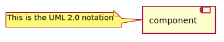
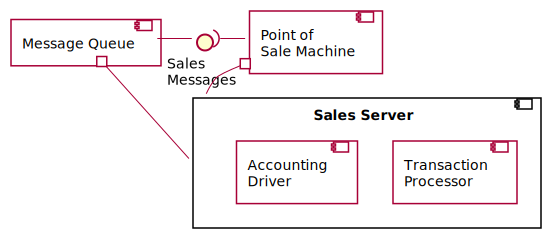

## Component Diagram

Component is a **set of classes with a well-defined interface**. They can be used to represent an architecture.
Components are connected through implemented and required interfaces, often using the `ball-andsocket notation` just as for class diagrams. You can also decompose components by using `composite structure` diagrams. A component is similar to a black box whose external behavior is defined by a provided interface and required interfaces.

[plantuml code](diagrams/ComponentUML2.0Notation.puml)

In this example, a POS machine can connect to a sales server component, using a sales message interface. 
Because the network is unreliable, a message queue component is set up so the POS machine can talk to the server
 when the network is up and talk to a queue when the network is down. 
The queue will then talk to the server when the network becomes available. As a result, the message queue both supplies the 
sales message interface to talk with the POS machine and requires that interface to talk with the server. The server is broken down into two
major components. The transaction processor realizes the sales message interface, and the accounting driver talks to the accounting system.

[plantuml code](diagrams/SalesServer.puml)

Ref:
	[1](https://www.geeksforgeeks.org/unified-modeling-language-uml-object-diagrams/),
	[2](https://www.guru99.com/component-diagram-uml-example.html),
	[3](https://www.guru99.com/component-diagram-uml-example.html),
	[4](https://www.smartdraw.com/component-diagram/)

	
