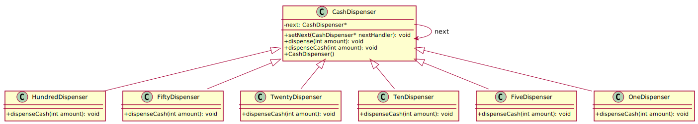

## Chain Of Responsibility
The **Chain of Responsibility** is a behavioral design pattern that allows a request to be passed along a chain of handlers until one of them processes it. This pattern promotes loose coupling, making it easier to modify and extend the request-processing sequence dynamically.


### Designing a Flexible Photo Processing Software

You are designing a **photo processing software** where users can apply multiple filters and transformations to an image. However, users may want to **apply different filters in different orders**, depending on their needs. Some users may want to remove red-eye before resizing, while others may prefer to adjust brightness before applying a blur effect.  

To solve this, you need a system that allows filters to be **chained together dynamically**, ensuring that each image goes through the configured sequence of operations. Instead of hardcoding the order, you want a **flexible and extensible approach**.  


**Solution: Chain of Responsibility Pattern**  

To achieve this flexibility, the **Chain of Responsibility** design pattern is used.  

- A **base class** (`PhotoProcessor`) defines a common interface for all filters.  
- Each filter (`RedEyeProcessor`, `ScalingProcessor`, `MeanFilterProcessor`, etc.) is implemented as a **separate class** that inherits from `PhotoProcessor`.  
- Each processor contains a **pointer to the next processor**, forming a **chain** of operations.  
- When an image is processed, it flows **sequentially** through the chain:  
  - Each processor **modifies** the image if applicable.  
  - If a processor cannot modify the image, it **delegates** processing to the next handler.  

---


In the following **Photo Processing** example, the **PhotoProcessor** class serves as the base handler, containing a pointer to the next processor in the chain. Each derived class (**redEye**, **scaling**, and **meanFilter**) implements the **processImplementation** method to apply a specific transformation to the photo. If a processor cannot fully handle the request, it delegates it to the next processor in the chain, ensuring a flexible and modular approach to image processing.

This pattern is useful when multiple objects can handle a request, but the specific handler is determined at runtime.


[plantuml code](diagrams/chain_of_responsibility.puml)


---

### **Benefits of This Approach**  

✅ **Dynamic Filter Ordering** – Users can arrange processing steps in any order they want.  
✅ **Modular & Extensible** – New filters can be added without modifying the existing pipeline.  
✅ **Efficient Processing** – Unnecessary filters are skipped, ensuring optimal performance.  
✅ **Scalability** – Can handle large batches of images with minimal performance overhead.  

This **Chain of Responsibility** implementation creates a **highly flexible** and **maintainable** photo processing system, allowing users to define their **own** image enhancement workflows effortlessly.


### ATM Machine 
In this example, we simulate an **ATM machine**, where a withdrawal request is handled by different denominations of **banknotes** (e.g., **$100, $50, $20, $10, $5, and $1**). Each banknote dispenser decides how many bills it can provide and passes the remaining amount to the next handler in the chain.

---


[plantuml code](diagrams/ATM_chain_of_responsibility.puml)


---

### **How It Works**
1. The **ATM Machine** follows the **Chain of Responsibility** pattern.
2. Each handler (banknote dispenser) processes as much of the requested amount as possible.
3. The remaining amount is passed to the next handler in the chain.
4. This continues until the full amount is dispensed.

---

### **Example Output**
```
Enter withdrawal amount: 385
Dispensing 3 x $100 bills
Dispensing 1 x $50 bills
Dispensing 1 x $20 bills
Dispensing 1 x $10 bills
Dispensing 1 x $5 bills
```

---

### **Key Benefits of This Approach**
✅ **Encapsulation**: Each dispenser handles its own logic.  
✅ **Scalability**: Adding new denominations is easy by creating new classes.  
✅ **Flexibility**: The order of dispensers can be changed dynamically.  
✅ **Avoids Large Conditionals**: Instead of using `if-else`, the responsibility is passed through a **chain**.


### **When to Use the Chain of Responsibility Pattern**
1. **Decoupling Request Senders from Handlers**  
   - When you need to process a request without specifying the exact handler.
   - Example: A logging system where different levels (INFO, WARNING, ERROR) decide how to process the message.

2. **Multiple Handlers for a Request**  
   - When different handlers may process the same request.
   - Example: Middleware in a web server (e.g., authentication, validation, and logging).

3. **Dynamic Request Handling**  
   - When the processing sequence needs to be changed dynamically at runtime.
   - Example: Configurable processing pipelines in image or document processing.

4. **Avoiding Monolithic Conditionals**  
   - When using multiple `if-else` or `switch` statements to determine the handler makes the code harder to maintain.
   - Example: Event handling where multiple objects can act on an event in different scenarios.

---

### **When NOT to Use the Chain of Responsibility Pattern**
1. **When Every Request Needs to Be Handled**  
   - If every request **must** be processed, this pattern might result in unhandled cases if not designed carefully.

2. **When Order of Execution is Critical**  
   - The chain processes requests sequentially, which may not be ideal when strict execution order or parallel execution is required.

3. **When the Chain Might Become Too Long**  
   - If the chain has too many handlers, performance may degrade due to excessive delegation.

4. **When Objects Have a Fixed Responsibility**  
   - If you know in advance which object should handle a request, directly calling that handler is more efficient.

---

### **Related Design Patterns**
1. **Command Pattern**  
   - Encapsulates a request as an object, allowing parameterization and queuing of requests.
   - **Difference**: Command focuses on executing a request, while Chain of Responsibility focuses on passing it through handlers.

2. **Decorator Pattern**  
   - Adds behavior dynamically without modifying the existing class structure.
   - **Difference**: Decorators always execute their behavior and wrap the next object, whereas Chain of Responsibility may pass the request without handling it.

3. **Observer Pattern**  
   - Notifies multiple objects when an event occurs.
   - **Difference**: Observer informs all subscribers, while Chain of Responsibility processes requests sequentially until one handles it.

4. **Mediator Pattern**  
   - Centralizes communication between objects to avoid direct dependencies.
   - **Difference**: Chain of Responsibility allows direct delegation to the next handler, while Mediator coordinates interactions between multiple objects.


C++ source code examples: [photo processor](../../../DesignPatern/src/Behavioral/ChainOfResponsibility/photo_processor.cpp), [chain of responsibility handler](../../../DesignPatern/src/Behavioral/ChainOfResponsibility/chain_of_responsibility_handler.cpp)


