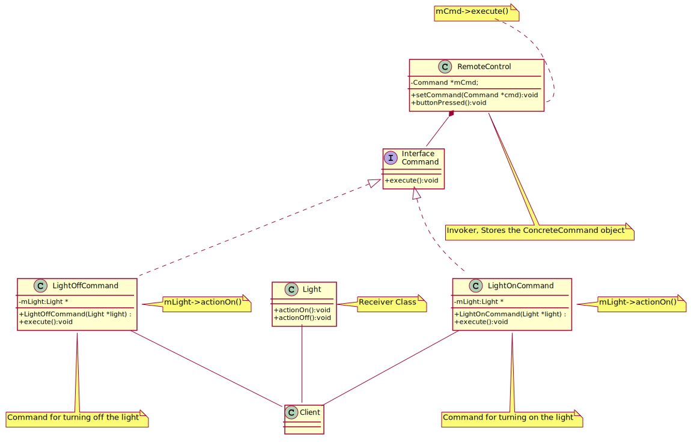

## Command
The **Command Design Pattern** is a behavioral design pattern that encapsulates a request as an object, allowing clients to parameterize objects with operations, delay execution, and support undoable operations.

### Remote Key and Light 
Imagine you walk into a room and want to turn the **light on and off** using a **remote control**. You press a button, and like magic, the light responds! But what happens behind the scenes?

In this example, we're designing a **flexible and decoupled system** using the **Command Pattern**, which allows us to control the light without the remote directly knowing how the light works.

---

In the following **PlantUML diagram**, the **Command Pattern** is illustrated with a simple example of controlling a light:

- The `Command` interface defines a standard `execute()` method.
- `LightOnCommand` and `LightOffCommand` are concrete command classes that encapsulate turning the light on and off.
- The `Light` class acts as the **receiver**, containing the actual methods `actionOn()` and `actionOff()`.
- `RemoteControl` is the **invoker** that stores a command and triggers its execution via `buttonPressed()`.
- The `Client` creates instances of commands and assigns them to the invoker.

This design promotes **loose coupling** between senders and receivers, enabling flexible command execution and potential undo functionality.

[plantuml code](diagrams/command.puml)

---

### **📖 What's Happening in Our Code?**  

1. **The Light (Receiver) 💡**  
   - The **light** is the actual device that turns **on and off**.
   - It has two methods: `actionOn()` and `actionOff()`, which print messages.

2. **The Commands **  
   - Instead of the remote directly calling `light.actionOn()`, we create **command objects**:
     - `LightOnCommand`: Calls `actionOn()` on the light.
     - `LightOffCommand`: Calls `actionOff()` on the light.
   - Each command **encapsulates** what should happen, making the system modular.

3. **The Remote Control (Invoker) **  
   - This acts as an interface between **the user and the commands**.
   - It stores a `Command` object and **executes it when a button is pressed**.
   - The **remote control doesn’t need to know anything about the light**—it just knows how to execute commands!

4. **The Client (The One Pressing the Button) **  
   - The **client** (our `main()` function) creates:
     - A `Light` object (the receiver).
     - A `LightOnCommand` and `LightOffCommand` linked to the light.
     - A `RemoteControl` to execute the commands.
   - The client **sets commands** in the remote and **presses the button** to turn the light on and off.

---

### **🔍 What Are We Achieving?**
✅ **Decoupling:** The remote doesn’t directly control the light, it just executes commands.  
✅ **Flexibility:** We can easily add new commands (e.g., "Dim Light") without changing the remote or light.  
✅ **Reusability:** The same `RemoteControl` can work with **any** command, not just lights!  

This pattern is commonly used in **smart home automation, GUI programming, and undoable actions** (like Ctrl+Z in text editors). 

Now, **press the button** and watch the magic happen! ✨

### ✅ **When to Use the Command Pattern**
1. **Decoupling Senders and Receivers**  
   - If you need to separate the object that initiates a request from the object that handles it, use the Command pattern. This improves flexibility and maintainability.

2. **Parameterizing Actions**  
   - When you want to store, queue, or log user actions as commands (e.g., GUI buttons, menu items, or transaction logs).

3. **Implementing Undo/Redo**  
   - Since each command encapsulates an action, you can maintain a history of executed commands and implement undo/redo functionality.

4. **Macro Commands (Batch Execution)**  
   - When you need to execute multiple commands as a sequence (e.g., scripting, batch processing, or composite commands).

5. **Job Queues & Thread Pools**  
   - In concurrent systems, commands can be queued and executed later in a worker thread.

---

### ❌ **When NOT to Use the Command Pattern**
1. **When Simple Function Calls Are Enough**  
   - If you just need to call a function and don't need undo/redo or parameterization, using the Command pattern can add unnecessary complexity.

2. **Overhead of Creating Many Small Classes**  
   - If each command needs a separate class, this can lead to class explosion, making code harder to maintain.

3. **Performance-Sensitive Applications**  
   - If commands are frequently created and discarded, object allocation and indirection could impact performance.

4. **Tight Coupling to a Single Execution Flow**  
   - If you don't need decoupling or flexibility in request handling, a direct function call may be simpler.

---

### 🔗 **Related Design Patterns**
- **Strategy Pattern**  
  - Similar in structure but focuses on dynamically choosing an algorithm rather than encapsulating requests.
  
- **Memento Pattern**  
  - Often used together with Command to implement undo/redo by storing snapshots of an object's state.
  
- **Observer Pattern**  
  - Can be used with Command to notify multiple objects when an action occurs.
  
- **Prototype Pattern**  
  - Commands can be cloned instead of creating new instances every time.
  
- **Chain of Responsibility Pattern**  
  - If multiple objects can handle a request, use a chain instead of an explicit invoker.

Would you like a more in-depth example of any of these concepts? 🚀

Source code examples:
[Light on command](../../../DesignPatern/src/Behavioral/Command/LightOnCommand.cpp), [giant command](../../../DesignPatern/src/Behavioral/Command/giant_command.cpp)

