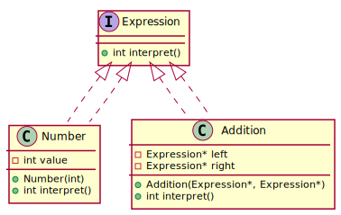
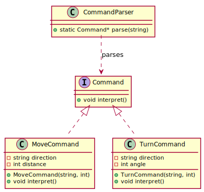

## Interpreter

The **Interpreter** design pattern is a **behavioral pattern** used to define a **grammar** for interpreting sentences in a language. It provides a way to evaluate sentences or expressions based on a given set of rules. This pattern is useful when working with languages, expressions, or simple interpreters.

### Simple Math Expression Interpreter
We'll create a simple interpreter that evaluates arithmetic expressions consisting of addition (`+`) and numbers.


  
[plantuml code](diagrams/math_expression_interpreter.puml)


### Explanation:
1. **Expression Interface** - Defines an abstract `interpret()` method.
2. **Number (Terminal Expression)** - Represents numbers and directly returns their value.
3. **Addition (Non-Terminal Expression)** - Evaluates the sum of two expressions.
4. **Main Function** - Creates an expression `(5 + 10)` and evaluates it.

This approach can be extended to support more operators and a full expression tree interpreter. 

### Designing a Robot Command Interpreter

You're developing a **robot control system** where users can send simple text-based commands like:
```
MOVE FORWARD 10
TURN LEFT 90
MOVE BACKWARD 5
```
Instead of hardcoding every possible command, you decide to implement an **Interpreter Pattern** to parse and execute these commands dynamically.


  
[plantuml code](diagrams/robot_command_interpreter.puml)


---

### **What's Happening in Our Code?**
We are designing a **mini command language** for our robot, where each command is an **expression** that gets interpreted and executed. The system will:
1. Read commands as strings.
2. Convert them into objects (expressions).
3. Evaluate and execute them dynamically.

Instead of manually handling each command with **if-else statements**, we let the **Interpreter Pattern** handle parsing and execution flexibly.

---

### ⚙️ **How It Works**
1. **Define an abstract `Command` interface** – Every robot command follows this interface.
2. **Create concrete command classes** – Each command (MOVE, TURN) is implemented as a separate class.
3. **Use a parser** – Converts strings into `Command` objects.
4. **Interpret and execute** – Each command executes its logic when interpreted.

---


### 📌 **When to Use the Interpreter Pattern**
Use the **Interpreter** pattern when:
1. **You have a simple grammar to interpret** – If your problem involves parsing and evaluating structured sentences or expressions (e.g., math expressions, custom scripting languages, or rule engines), the Interpreter pattern is a good fit.
2. **The grammar is stable and small** – This pattern works best when the number of rules in the grammar is relatively limited and does not change often.
3. **You need a customizable evaluation process** – If users or developers need to define new rules or expressions dynamically, this pattern provides flexibility.
4. **You want an object-oriented approach to parsing** – It allows defining expressions as objects and evaluating them using a tree structure.

### ❌ **When NOT to Use the Interpreter Pattern**
Avoid the **Interpreter** pattern when:
1. **The grammar is too complex** – If you have a large set of rules or a complex language (e.g., a full programming language), this pattern becomes inefficient and hard to maintain.
   - 🔹 *Alternative*: Use a **parser generator** like ANTLR or regular expressions for efficient parsing.
2. **Performance is critical** – Since this pattern represents expressions as objects and builds trees, it consumes more memory and has execution overhead.
   - 🔹 *Alternative*: Convert expressions into bytecode or an **Abstract Syntax Tree (AST)** and evaluate them efficiently.
3. **The number of expression types keeps increasing** – If you frequently add new grammar rules, the codebase becomes hard to maintain.
   - 🔹 *Alternative*: Use the **Visitor Pattern** to separate interpretation logic from the structure.

### 🔗 **Related Design Patterns**
The **Interpreter** pattern is often used alongside or as an alternative to:
1. **Composite Pattern** – The tree structure used in the Interpreter pattern is similar to the Composite pattern, which treats individual objects and compositions uniformly.
2. **Visitor Pattern** – When interpretation logic becomes too complex, the Visitor pattern helps separate the grammar structure from the logic.
3. **Flyweight Pattern** – To optimize memory usage in case of repeated expressions (e.g., large ASTs), Flyweight can be used to share common subexpressions.
4. **Builder Pattern** – If parsing an input language is required before interpreting, the Builder pattern can help construct expression trees.


Source code examples:
[Robot Command Interpreter](../../../DesignPatern/src/Behavioral/Interpreter/robot_command_interpreter.cpp), [Math Expression Interpreter](../../../DesignPatern/src/Behavioral/Interpreter/math_expression_interpreter.cpp)


