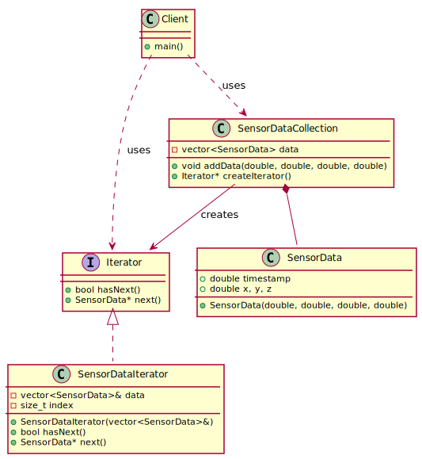

## Iterator
Iterator is a behavioral design pattern that lets you traverse elements of a collection without exposing its underlying representation (list, stack, tree, etc.).

## Implementing the Iterator Design Pattern in a C++ Data Processing Application**

Imagine You Are Designing Software for a **drone-based mapping system** that collects massive amounts of sensor data, such as point clouds and images, during flights. Your software needs to process these data efficiently, allowing different modules (visualization, storage, and analysis) to iterate over them without exposing the internal data structure.

You decide to use the **Iterator design pattern** to provide a clean way to traverse these datasets while maintaining flexibility.

---

[plantuml code](diagrams/iterator_design_pattern.puml)

---

## **What's Happening in Our Code?**  
Instead of giving direct access to the internal data storage (which might be an `std::vector`, `std::list`, or even a custom container), we **encapsulate the iteration logic in an Iterator**. This way, different parts of the application (e.g., SLAM processing, visualization, logging) can iterate through the data **without worrying about how it's stored**.

---

## **What Are We Achieving?**  
✅ **Encapsulation:** The internal structure of our dataset remains hidden.  
✅ **Uniform Access:** Different types of containers (point clouds, images, telemetry) expose a **common interface** for iteration.  
✅ **Flexibility:** If we change the storage format later (e.g., from `std::vector` to a more memory-efficient linked list), we **don't break existing code**.  
✅ **Multiple Iterations:** We can have **multiple iterators** iterating at different speeds (e.g., one iterates per frame, another skips every second frame).  

---

## **How It Works**
1. **Define an `Iterator` Interface** – This includes basic traversal operations like `next()`, `hasNext()`, and `current()`.  
2. **Implement a Concrete Iterator** – This class holds a reference to the collection and implements the traversal logic.  
3. **Create an Iterable Collection** – The dataset class (e.g., `PointCloudCollection`) provides an interface to retrieve an iterator.  
4. **Use the Iterator** – The client code retrieves an iterator and processes elements **without needing to know** how the collection is implemented.  

---

## **Key Benefits of This Approach**
🔹 **Decouples iteration logic from data structure** – Your storage format can change without affecting clients.  
🔹 **Supports multiple iteration strategies** – You can implement **filtered iterators**, **reverse iterators**, etc.  
🔹 **Enhances testability** – Iterators can be tested independently from the data container.  
🔹 **Works well with standard C++ algorithms** – Since iterators align with STL concepts, you can use `std::for_each()`, `std::accumulate()`, etc.  

---

## **When Should I Use It?** ✅  
✅ **You need to traverse a complex data structure without exposing its implementation.**  
✅ **You want multiple ways to iterate over data (e.g., forward, reverse, or skipping elements).**  
✅ **You plan to support different collections with a unified interface.**  
✅ **Your data structure might change, but you want iteration logic to remain stable.**  

---

## **When Shouldn't I Use It?** ❌  
❌ **Your data structure is simple, and `for` loops work fine.** If you don’t need abstraction, using a raw loop is simpler.  
❌ **You don’t need multiple ways to iterate.** If all elements are always accessed sequentially, an iterator adds unnecessary complexity.  
❌ **You are working with performance-critical code.** Iterators introduce a layer of abstraction, which may add slight overhead in extreme performance-sensitive applications.  

---

## **Related Patterns** 🔗  
🔗 **Composite Pattern** – Often used with iterators when dealing with hierarchical structures (e.g., a scene graph).  
🔗 **Visitor Pattern** – If you need to apply operations while traversing a structure, consider **Visitor** instead.  
🔗 **Factory Method** – Useful for generating iterators dynamically based on different traversal strategies.  
🔗 **Decorator Pattern** – Can be used to modify or extend iterators (e.g., filtering outliers from a point cloud).  

---

Source code examples:
[iterator](../../../DesignPatern/src/Behavioral/Iterator/iterator_design_pattern.cpp)
