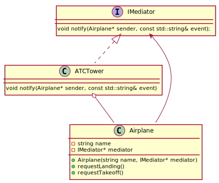
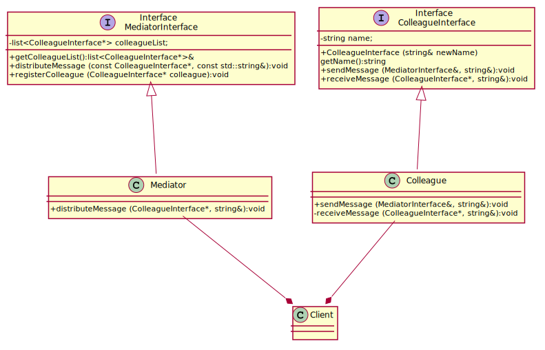

## Mediator


### Air Traffic Control System
Imagine you're developing an **Air Traffic Control (ATC) system** that manages communication between multiple airplanes approaching an airport. Each aircraft needs to be aware of other planes in the vicinity, but if every plane directly communicated with every other plane, the system would become chaotic and difficult to scale. Think of it like a **group chat** where instead of each person messaging everyone, they talk to a **moderator**, and the moderator relays messages to the right people. 

Instead of letting airplanes communicate directly with one another, we introduce an **ATC tower (Mediator)** that centralizes communication. Each airplane sends its status (altitude, speed, position) to the tower, and the tower coordinates responses, preventing collisions and ensuring smooth operations.  

---

  
[plantuml code](diagrams/air_traffic_control.puml)

---


### **The Players in Our System**
1️⃣ **IMediator (The Contract)**  
   - This is just a **blueprint (interface)** that says:  
     _"Hey, whatever class implements me needs to have a `notify()` function that lets objects send messages through me."_
   - The `notify()` method is the **main communication channel** between objects.

2️⃣ **ATCTower (The Middleman)**  
   - This is our actual **mediator**, the "middleman" that makes decisions.  
   - It keeps track of:
     - **Planes in the air** ✈️  
     - **Planes on the ground** 🛬  
   - When a plane wants to land or take off, it **asks** the ATC Tower.
   - The ATC Tower **decides** whether it's safe and informs the plane.

3️⃣ **Airplane (The Clients)**  
   - These are the **actual planes**.  
   - Each plane **doesn’t talk to other planes**; it only talks to the **ATC Tower**.
   - It can:
     - Ask for **landing permission**  
     - Ask for **takeoff permission**  

---

### **How Do They Collaborate? (The Data Flow)**
Let's say we have **three airplanes** in the sky and one on the ground.  

✈️ **Flight A123** wants to land.  
🛫 **Flight C789** wants to take off.  

Here’s how the **data flows** through the system:  

1️⃣ **Flight A123** → "Hey ATC, I need to land!"  
   - The plane calls `requestLanding()`.  
   - Instead of messaging other planes, it **talks to the ATC Tower**.

2️⃣ **ATCTower** → "Let me check..."  
   - The ATC checks: Is the runway free?  
   - If yes, it **grants permission** and **tells the plane to land**.  
   - If not, it **denies permission** and tells the plane to hold.

3️⃣ **Flight A123 Lands**  
   - The ATC moves **Flight A123** from **"air"** to **"ground"**.

4️⃣ **Flight C789** → "ATC, I want to take off!"  
   - The ATC checks: Is the runway available?  
   - If yes, it **grants permission** and tells **Flight C789** to take off.

5️⃣ **Flight C789 Takes Off**  
   - The ATC moves **Flight C789** from **"ground"** to **"air"**.

💡 **Notice how no plane directly talks to another?**  
Everything goes through **ATC Tower**, which acts as the decision-maker.

---

### **How It Works in Terms of Code?**
Now, let’s connect this to some programming concepts:

#### **Interface (IMediator) → The Contract**
- The `IMediator` is like a **rulebook** that the **ATCTower** follows.  
- It says, _"Whoever becomes the mediator must have a `notify()` function."_  
- This makes sure our design is **flexible**—we could replace `ATCTower` with something else later!

```cpp
class IMediator {
public:
    virtual void notify(Airplane* sender, const std::string& event) = 0;
};
```

---

#### **Concrete Mediator (ATCTower) → The Traffic Controller**
- `ATCTower` is the **real boss** that actually does the work.  
- It **implements** `IMediator`, meaning it **inherits from it** and provides the actual logic.  
- It **stores lists of airplanes** that are flying and landed.  
- When a plane asks to land, it **checks the list** and **decides** whether to allow it.

```cpp
class ATCTower : public IMediator {
private:
    std::vector<Airplane*> airplanesInAir;
    std::vector<Airplane*> airplanesOnGround;
public:
    void notify(Airplane* sender, const std::string& event) override {
        if (event == "LandingRequest") {
            if (airplanesOnGround.empty()) {
                sender->land();
                moveAirplane(sender, airplanesInAir, airplanesOnGround);
            }
        }
    }
};
```

---

#### **Airplane (The Client) → The Players**
- Each **Airplane object** represents a real plane.
- It doesn’t **store info about other planes**, only the **mediator (ATCTower)**.
- If it wants to land or take off, it just **asks ATC**.

```cpp
class Airplane {
private:
    std::string name;
    IMediator* mediator;
public:
    Airplane(std::string name, IMediator* mediator) : name(name), mediator(mediator) {}

    void requestLanding() {
        mediator->notify(this, "LandingRequest");
    }
};
```

---

### **How It Helps Us?**
**Why Not Just Let Planes Talk to Each Other?**  
- Because that would be **chaos**! Every plane would have to check every other plane's status.  
- Imagine **10 planes**—each one talking to 9 others. That's **90 direct connections**.  
- With a **mediator (ATC Tower),** each plane only needs to talk to **one object**.

💡 **Key Benefits of Using the Mediator Pattern**
✅ **Decouples Objects**: Planes don’t depend on each other—only on ATC.  
✅ **Encapsulates Communication**: Instead of `N * (N-1)` connections, we just have `N`.  
✅ **Scalable**: Adding new planes **doesn’t require modifying old ones**.  
✅ **Easier to Maintain**: We **only** modify the ATC Tower when changing logic.  

---

### **Final Thoughts (TL;DR)**
🎯 **We have three main parts**:
- **IMediator** → The **contract** (rulebook).
- **ATCTower** → The **middleman** (traffic controller).
- **Airplane** → The **clients** (the actual planes).

**Planes don’t talk to each other**. They only talk to the **ATC Tower**, which decides everything.  

💡 **Why use this?**  
- Makes communication **simpler and organized**.  
- Allows **adding new planes easily** without breaking anything.  
- Reduces **complexity** in a system where multiple objects interact.  

---


### **Key Benefits of This Approach**  
✅ **Reduces direct dependencies**: Airplanes don't need to track other planes.  
✅ **Centralized control**: The ATC Tower ensures smooth coordination.  
✅ **Scalable**: Adding new airplanes doesn’t require modifying existing planes.  
✅ **More readable and maintainable code**: The mediator encapsulates interaction logic in one place.  

---


## Chat room 


 
[plantuml code](diagrams/chat_mediator.puml)


---

## **What Do We Have in Our System?**  

We are designing a **messaging system** where different "colleagues" (employees, users, whatever you want) need to communicate **through a central mediator** instead of talking to each other directly.  

Think of it as a **group chat with a moderator**—users don’t send messages directly to each other; instead, they **send messages to the mediator**, and the mediator **decides who should receive them**.  

Now, let's **translate that idea into our UML components**.

---

## **1️⃣ The Interfaces (Blueprints for our system)**
### **MediatorInterface (The Moderator Contract)**
📝 This is the blueprint for any **mediator** (middleman) that wants to manage communication.  

- It keeps a **list of colleagues** who are part of the system (`colleagueList`).  
- It has two key responsibilities:  
  1. `distributeMessage()` → When someone sends a message, the mediator decides **who should receive it**.  
  2. `registerColleague()` → When a new user joins, the mediator **adds them to the group**.

📌 **In UML terms:**  
✅ `MediatorInterface` is an **interface** (a contract) that other mediators (like `Mediator`) must follow.  
✅ `Mediator` **inherits from** (`implements`) `MediatorInterface`.  

---

### **ColleagueInterface (The User Contract)**
📝 This is the **base class (interface)** for any "user" or "colleague" who can send and receive messages.

- It stores the **name** of the user (so we know who sent the message).  
- It has two key responsibilities:  
  1. `sendMessage()` → The user sends a message, but **instead of sending it to another user directly, it goes to the mediator**.  
  2. `receiveMessage()` → The user **gets a message from the mediator** when someone else sends something.  

📌 **In UML terms:**  
✅ `ColleagueInterface` is an **interface** that defines **how users should behave**.  
✅ `Colleague` **inherits from** (`implements`) `ColleagueInterface`.  

---

## **2️⃣ The Concrete Classes (Actual Implementations)**
Now we have **real, working classes** that use these interfaces.

### **Mediator (The Actual Middleman)**
🚦 This is the **real traffic controller** of our system.

- It **inherits from** `MediatorInterface`, meaning it **must** implement `distributeMessage()`.  
- It **stores** a list of colleagues (`colleagueList`).  
- When a user sends a message, it **loops through all colleagues** and **delivers the message to the right people**.

🔧 **How it works in the code:**
1. A **colleague (user)** sends a message to the mediator.  
2. The mediator **goes through the list** and finds all users **except the sender**.  
3. It **delivers the message** only to the correct recipients.

📌 **In UML terms:**  
✅ `Mediator` **inherits from** `MediatorInterface`.  
✅ It **implements the logic** for handling and distributing messages.  

---

### **Colleague (A Real User)**
💡 This is a **real user** in the system.

- It **inherits from** `ColleagueInterface`, meaning it **must** implement `sendMessage()` and `receiveMessage()`.  
- But instead of talking **directly to another user**, it **only talks to the mediator**.  

🔧 **How it works in the code:**
1. A user **sends a message** → `sendMessage()`  
2. The message **goes to the mediator** instead of another user.  
3. The mediator **decides who gets the message**.  
4. Each recipient **receives the message** via `receiveMessage()`.  

📌 **In UML terms:**  
✅ `Colleague` **inherits from** `ColleagueInterface`.  
✅ It **implements the actual messaging logic** for users.  

---

## **3️⃣ How Does the Data Flow?**
Let's say we have **four users**: Bob, Sam, Frank, and Tom.

🔵 **Step 1: Register Users**  
- The mediator **adds** Bob, Sam, Frank, and Tom to its list.  
- Now the mediator **knows who is in the system**.

🔵 **Step 2: Bob Sends a Message**  
- Bob calls `sendMessage(mediator, "I'm quitting!")`.  
- Instead of messaging Sam, Frank, or Tom **directly**, Bob just **hands the message over to the mediator**.

🔵 **Step 3: The Mediator Distributes the Message**  
- The mediator **loops through all users** except Bob.  
- It **delivers Bob’s message to Sam, Frank, and Tom** by calling `receiveMessage()` on each of them.  

🔵 **Step 4: Each User Receives the Message**  
- Sam, Frank, and Tom **print out the message** on their screen.  

✅ **Mission accomplished!** No direct communication, only through the **mediator**.

---

## **4️⃣ How the UML Diagram Represents This?**
Now let's **match this with your UML diagram**.

### **A. Inheritance (↗️ "Implements" Relationships)**
✅ `Mediator` **inherits from** `MediatorInterface` (`Mediator -up--|> MediatorInterface`).  
✅ `Colleague` **inherits from** `ColleagueInterface` (`Colleague -up--|> ColleagueInterface`).  

### **B. Aggregation (⭑ "Has-a" Relationships)**
✅ `Mediator` **has a list of** colleagues (`colleagueList`) → (`Mediator -up--* Client`).  
✅ `Colleague` **is used in** the Client (`Colleague -up--* Client`).  

### **C. Message Flow (How they talk to each other)**
- A **colleague sends a message** to the mediator.  
- The **mediator loops through** the colleague list and **calls `receiveMessage()`** for each one.  
- The **message reaches the right people**.  

---

## **5️⃣ Final Summary (TL;DR)**
🎯 **What do we have?**  
- A **mediator (middleman)** that controls message distribution.  
- Multiple **colleagues (users)** who talk **only to the mediator**.  

📌 **How do they collaborate?**  
1. **Colleagues send messages** → to the **mediator** (not to other colleagues directly).  
2. **Mediator distributes messages** → to the **right users**.  
3. **Colleagues receive messages** → from the **mediator**.  

📌 **How is this represented in UML?**  
- **Interfaces (`IMediator` & `IColleague`)** define the contract.  
- **Concrete classes (`Mediator` & `Colleague`)** implement the behavior.  
- **Relationships (`-up--|>` for inheritance, `-up--*` for aggregation)** show **who depends on whom**.  

---

🚀 **Why is this useful?**  
✅ No **direct** dependencies between objects → Makes the system easier to **modify**.  
✅ The **mediator handles all communication** → Reduces **complexity** in interactions.  
✅ Adding **new users** is easy → No need to modify existing ones!  

---


### **When Should I Use It?** ✅  
✔ When multiple objects interact in a complex way, making direct communication difficult.  
✔ When you want to **reduce dependencies** between interacting objects.  
✔ When you need a **central authority** managing interactions.  
✔ When you expect the number of interacting components to grow over time.  

---

### **When Shouldn’t I Use It?** ❌  
✘ If objects have **simple interactions** and a mediator would add unnecessary complexity.  
✘ If having a **central mediator** creates a **single point of failure** that could lead to performance bottlenecks.  
✘ If you don’t need **dynamic, runtime** interaction management—direct communication may be more efficient.  

---

### **Related Patterns** 🔗  
🔗 **Observer**: If objects need to be notified of events rather than interacting directly, an Observer pattern may be a better fit.  
🔗 **Facade**: If you just want to **simplify** interactions but don’t need to manage dynamic communication, a Facade can provide a simpler interface.  
🔗 **Command**: If you need to **encapsulate requests as objects** instead of directly managing communication.  


Source code examples:
[Chat room mediator](../../../DesignPatern/src/Behavioral/Mediator/chat_room_mediator.cpp), 
[Airport traffic pattern](../../../DesignPatern/src/Behavioral/Mediator/air_traffic_control.cpp), 
[Mediator before after](../../../DesignPatern/src/Behavioral/Mediator/mediator_before_after.cpp)


