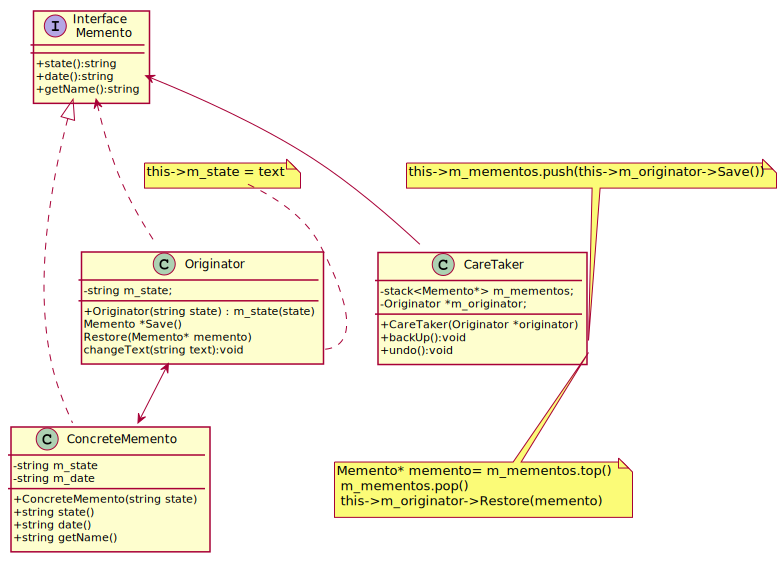

## 6. Memento

Memento is a behavioral design pattern that lets you save and restore the previous state of an object without revealing the details of its implementation.

[plantuml code](diagrams/notepad_memento.puml)

You can use **Command** and **Memento** together when implementing “undo”. In this case, commands are responsible for performing various operations over a target object, while mementos save the state of that object just before a command gets executed.

You can use **Memento** along with **Iterator** to capture the current iteration state and roll it back if necessary.

Sometimes **Prototype** can be a simpler alternative to Memento. This works if the object, the state of which you want to store in the history, is fairly straightforward and doesn’t have links to external resources, or the links are easy to re-establish.

Source code examples:
[notepad memento](../../../DesignPatern/src/Behavioral/Memento/notepad_memento.cpp)

