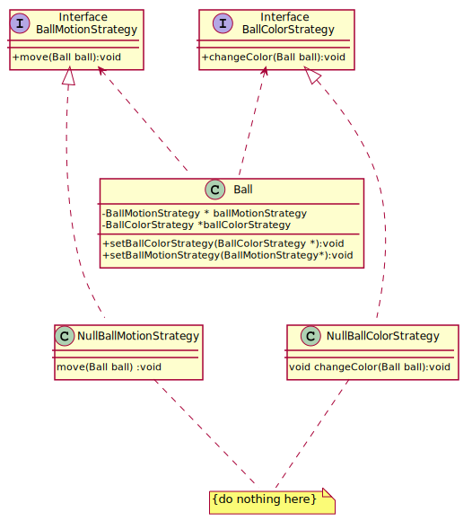

## NullObject
Sometimes a class that requires a collaborator does not need the collaborator to do anything. A null object is an object with no referenced value or with defined neutral ("null") behavior. The null object design pattern describes the uses of such objects and their behavior. Instead of using a null reference (nullptr in C++) to convey absence of an object (for instance, 
a non-existent customer), one uses an object which implements the expected interface, but whose method body is empty. 
The advantage of this approach over a working default implementation is that a null object is very predictable and has no side effects: 
it does nothing.

Consider for example a simple screen saver which displays balls that move about the screen and have special color effects. This is easily achieved by creating a Ball class to represent the balls and using a Strategy pattern [GHJV95, page 315] to control the ball's motion and another Strategy pattern to control the ball's color.

Here, the idea is that there are situations where a pointer or reference to an Animal object is required, but there is no appropriate object available. A null reference is impossible in standard-conforming C++. A null Animal* pointer is possible, and could be useful as a place-holder, but may not be used for direct dispatch: a->MakeSound() is undefined behavior if a is a null pointer.

The null object pattern solves this problem by providing a special NullAnimal class which can be instantiated bound to an Animal pointer or reference.

[plantuml code](diagrams/ball_null_object.puml)

Source code examples:
[animal null object](../../../DesignPatern/src/Behavioral/NullObject/animal_null_object.cpp), [binary tree null object](../../../DesignPatern/src/Behavioral/NullObject/binary_tree_null_object.cpp),[ball_screen_saver_null_object](../../../DesignPatern/src/Behavioral/NullObject/ball_screen_saver_null_object.cpp)
