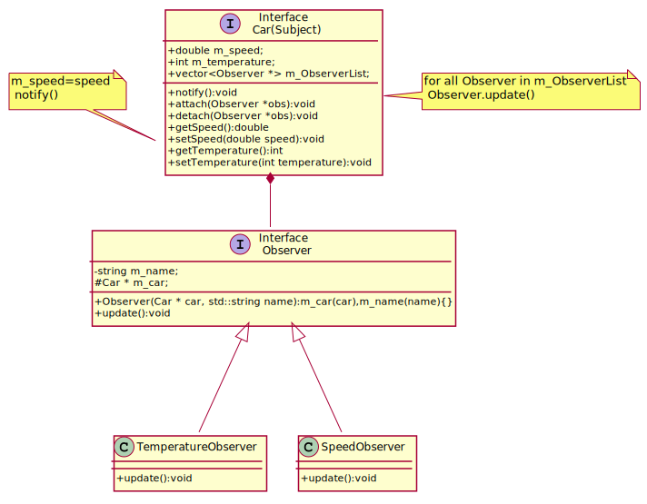

## 8. Observer

The **Observer** design pattern is a behavioral pattern that establishes a one-to-many dependency between objects. When the subject (also called the observable) changes state, all its dependent observers are automatically notified and updated.
 Observer is the "View" part of Model-View-Controller.
 
### Display of Car Sensory Data
A car equipped with built-in sensors and a state-of-the-art notification system. Auto can monitor its **speed** and **temperature** in real time, ensuring that any significant changes are immediately communicated to its observers. More sensors cloud be added or we can turn off monitoring a specific sensor.

The car maintains a **list of observers** who watch over its performance. Whenever something changes—whether it's acceleration or an overheating engine—Auto **notifies all the observers instantly**.

---

In the **UML diagram**, the **Car** class acts as the **Subject** (Observable), while the **SpeedObserver** and **TemperatureObserver** classes represent the **Observers**. 

- **Car (Subject)**
  - Maintains a list of observers (`m_ObserverList`).
  - Notifies all observers whenever its state changes (`notify()`).
  - Provides methods to attach (`attach()`) and detach (`detach()`) observers.

- **Observer Interface**
  - Defines an abstract `update()` method that all concrete observers must implement.

- **Concrete Observers (SpeedObserver & TemperatureObserver)**
  - Implement the `update()` method to react to changes in the **Car's** state.

This pattern is useful in event-driven programming, real-time monitoring, and UI development where multiple components need to respond dynamically to changes in a subject.

---

[plantuml code](diagrams/observer.puml)

---

### **What Are We Achieving?**
1. **Decoupling Components** – The Car and Observers are loosely coupled, meaning **Auto does not need to know the details of each observer**—it just notifies them.  
2. **Event-Driven Design** – The car **pushes updates to observers** rather than making them manually check for changes.  
3. **Extensibility** – New observers (like a FuelMonitor or GPS tracker) can be added **without modifying** Auto’s existing code.  
4. **Efficient Communication** – Observers only react when something **actually changes**, avoiding unnecessary work.  

By implementing the **Observer pattern**, our smart car becomes an event-driven system where different sensors work **independently but harmoniously**, just like a real-world car dashboard providing instant feedback to the driver. 🚗💨

### ✅ **When to Use the Observer Pattern**
You should use the **Observer** pattern when:
1. **One-to-Many Relationship Exists** – When multiple objects (observers) need to be automatically updated when a single object (subject) changes state.
2. **Decoupling is Required** – When you want to **decouple the subject from its observers**, making it easy to add/remove observers dynamically without modifying the subject.
3. **Push-based Updates** – When the subject should "push" state changes to observers without them constantly polling for updates.
4. **Real-time Event Handling** – Common in event-driven architectures (e.g., GUI applications, real-time monitoring systems, stock price updates).
5. **Logging & Notifications** – When changes in an object should trigger notifications (e.g., logging system updates when a critical value changes).

---

### ❌**When NOT to Use the Observer Pattern**
Avoid using the Observer pattern when:
1. **Few or No Observers Exist** – If the subject will only ever have one or two observers, a direct method call may be simpler.
2. **High Frequency of Updates Causes Performance Issues** – If the subject changes state frequently and not all observers need every update, the notification overhead can be costly.
3. **Complex Dependencies Exist** – If observers have dependencies among themselves, unintended side effects or update ordering issues may arise.
4. **Observers Require Immediate Updates** – In time-sensitive systems (e.g., hard real-time systems), a direct function call is often preferable.
5. **Synchronization Issues Occur** – In multi-threaded environments, managing concurrency between subject and observers can be challenging.

---

### 🔗**Related Design Patterns**
The **Observer pattern** is closely related to several other patterns:

1. **Publisher-Subscriber (Pub-Sub)**
   - A more flexible variation of Observer where an event bus decouples publishers from subscribers.
   - Used in **message queues, event-driven architectures**.
   - Difference: Observer has direct reference to observers; Pub-Sub uses an event broker.

2. **Mediator**
   - Manages communication between multiple objects, similar to Observer.
   - Difference: Instead of direct notification, objects communicate through a **central mediator**.

3. **Singleton**
   - Often used with Observer when a **global subject** instance needs to be observed across the system.

4. **MVC (Model-View-Controller)**
   - The **Model** acts as the subject, while **Views** observe it and update accordingly.
   - Frequently used in GUI applications.

5. **Command**
   - Sometimes used with Observer when updates to observers should be handled as queued **commands**.

By understanding these use cases and trade-offs, you can decide whether the **Observer** pattern is the right choice for your application.

Source code examples:
[car parts observer](../../../DesignPatern/src/Behavioral/Observer/car_observer.cpp), [clocktimer](../../../DesignPatern/src/Behavioral/Observer/clocktimer.cpp), [rocket observer](../../../DesignPatern/src/Behavioral/Observer/rocket_observer.cpp),[weather station observer](../../../DesignPatern/src/Behavioral/Observer/weather_station_observer.cpp), [chat room observer](../../../DesignPatern/src/Behavioral/Observer/chat_room_observer.cpp)
