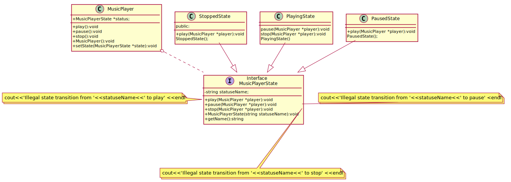

## State

State pattern allows an object to alter its behavior when its internal state changes. This pattern is close to the concept of finite-state machines.
The state pattern can be interpreted as a strategy pattern, which is able to switch a strategy through invocations of methods defined in the
 pattern's interface.

[plantuml code](diagrams/music_player_state.puml)

Source code examples:
[music player state](../../../DesignPatern/src/Behavioral/State/music_player_state.cpp), [machine on off state](State/machine_on_off_state.cpp) 

