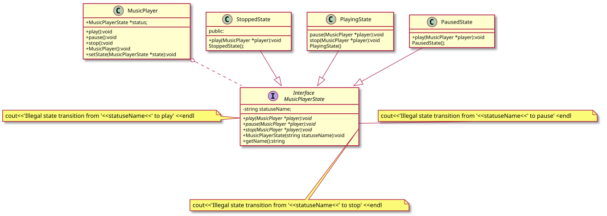

## State

State pattern allows an object to alter its behavior when its internal state changes. This pattern is close to the concept of finite-state machines.
The state pattern can be interpreted as a strategy pattern, which is able to switch a strategy through invocations of methods defined in the
 pattern's interface.



[plantuml code](diagrams/music_player_state.puml)

Source code examples:
[music player state](../../../DesignPatern/src/Behavioral/State/music_player_state.cpp), [machine on off state](State/machine_on_off_state.cpp)

---

## Is the OOP State pattern a good fit for robotics?

It depends on where in the stack. The classic OOP version is reasonable for **high-level supervisory** code, and a **poor fit for hot paths** where most robotics code actually lives. There are usually better tools.

### Where this approach works in robotics

- **State transitions are infrequent.** A mission-level planner that switches between *Idle → Navigating → Docking → Charging* once every few seconds doesn't care about an extra heap allocation per transition.
- **Each state has rich behavior.** If `Navigating` has its own helper functions, member data, and 100+ lines of logic, a polymorphic class is a clean container for it.
- **The state set is open or grows often.** New mission states added by different teams or as plugins.
- **The thread isn't realtime.** UI, supervisory layer, ROS lifecycle nodes — pure OOP is fine.

### Where it's the wrong tool

- **Control loops at kHz rates.** Every `std::make_unique<NewState>()` is a heap allocation — non-deterministic latency, possible fragmentation on long-running embedded systems. Realtime threads typically forbid `new` entirely.
- **Sensor processing pipelines.** Virtual dispatch and heap-scattered state objects wreck cache locality and add indirection per call.
- **Embedded / safety-critical firmware.** Dynamic memory is often disallowed (MISRA C++, AUTOSAR) and the dispatch overhead is unacceptable.
- **State machines that need formal verification.** A polymorphic hierarchy is hard to model-check; an enum or transition table is straightforward.

### Alternatives

| Approach                                   | Best for                                                                | Allocation     | Dispatch            |
| ------------------------------------------ | ----------------------------------------------------------------------- | -------------- | ------------------- |
| `enum class` + `switch`                    | Tight loops, embedded firmware, fixed small state sets                  | none           | direct + jump table |
| `std::variant<States...>` + `std::visit`   | Modern C++ default — states with per-state data, type-safe, exhaustive  | none (inline)  | inlined / static    |
| **OOP State pattern (this code)**          | Mission-level, supervisory, plugin-style                                | per transition | virtual             |
| Boost.SML / Miro Samek's QP / `boost::msm` | Hierarchical state machines, formal transitions, embedded               | static         | table-driven        |

For most robotics state machines, reach for `std::variant` + `std::visit` first. Enum + switch is a strong second when states have no per-state data. The OOP State pattern is third — fine when you genuinely need open-ended polymorphism and the path isn't hot.

### The same machine as a `std::variant`

The `AudioPlayer` example with no inheritance, no heap, and compile-time exhaustiveness:

```cpp
struct StopMode  {};
struct PlayMode  {};
struct PauseMode {};

using PlayerState = std::variant<StopMode, PlayMode, PauseMode>;

// Helper that turns a list of lambdas into one overloaded visitor.
template <class... Fs> struct overloaded : Fs... { using Fs::operator()...; };
template <class... Fs> overloaded(Fs...) -> overloaded<Fs...>;

class AudioPlayer {
    PlayerState state_ = StopMode{};

public:
    void play() {
        state_ = std::visit(overloaded{
            [](StopMode)   -> PlayerState { return PlayMode{}; },
            [](PlayMode s) -> PlayerState { reject("PLAY"); return s; },
            [](PauseMode)  -> PlayerState { return PlayMode{}; },
        }, state_);
    }
    // pause(), stop() follow the same shape
};
```

Compared to the inheritance version:

- **Zero allocation.** State lives inline in `AudioPlayer`.
- **Compile-time exhaustive.** Add `RewindMode` to the variant — every `std::visit` site fails to compile until you add a handler. The OOP version would silently inherit the "invalid transition" default.
- **No vtable, no indirection.** The compiler can often inline the entire dispatch.
- **Per-state data is natural.** `PlayMode { Track t; Position p; }` carries data only when the state has it.

### Concrete recommendations by layer

| Layer of the stack                                    | Recommendation                              |
| ----------------------------------------------------- | ------------------------------------------- |
| Realtime control loops, motor drivers, EtherCAT       | `enum class` + `switch`                     |
| Sensor processing, CAN parsing, perception pipelines  | `std::variant` + `std::visit`               |
| Behavior planner, mission supervisor                  | `std::variant` + `std::visit`, or HSM lib   |
| Lifecycle / ROS node states, plugin systems           | OOP State pattern (the code above) is fine  |
| Hierarchical safety state machines                    | Boost.SML or Miro Samek's QP framework      |

The refactored `unique_ptr` version is the right shape *for the OOP pattern*. But in real robotics code at the control layer, the OOP State pattern is usually the wrong starting point — `std::variant` + `std::visit` will serve you better.

