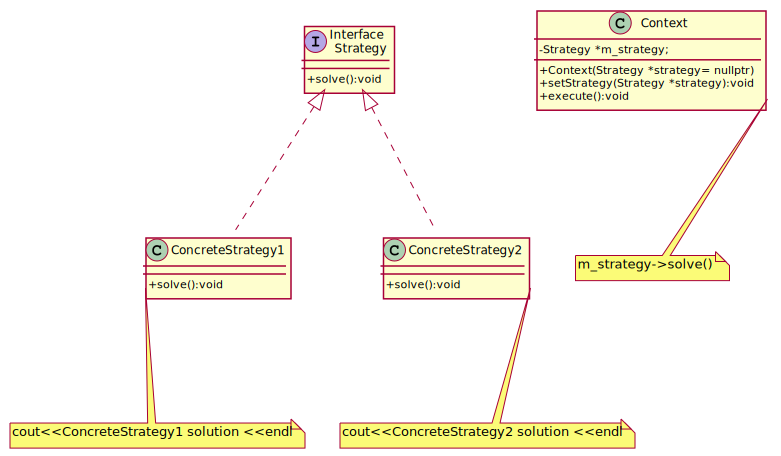

##  Strategy

The **Strategy Design Pattern** is a behavioral design pattern that allows a family of algorithms to be defined, encapsulated, and interchanged dynamically. It promotes flexibility by enabling an object (context) to change its behavior by switching between different strategies without altering its code.

### The Adaptive Combat Robot

We are designing an intelligent **combat robot** that can dynamically change its behavior based on different situations. Instead of hardcoding specific movement, attack, and defense strategies, we use the **Strategy Design Pattern** to allow flexible, interchangeable actions.

- `Strategy` (Interface) defines a common interface for all algorithms.
- `ConcreteStrategy1` and `ConcreteStrategy2` implement different variations of the algorithm.
- `Context` holds a reference to a `Strategy` object and delegates execution to it.
- The strategy can be set dynamically via `setStrategy()`.

This approach ensures modularity, adherence to the **Open-Closed Principle**, and easy extension of new strategies without modifying existing code.

[plantuml code](diagrams/conceptual_strategy.puml)

 **How It Works**
- A **robot** has three key abilities: **searching**, **attacking**, and **defending**.
- Instead of hardcoding these behaviors, we define them as separate **Strategy** classes.
- The robot **receives a strategy dynamically** and can change it **at runtime**.
- We implement **both runtime and compile-time polymorphism**:
  - **Runtime Polymorphism:** Uses base class pointers (`Strategy*`) to switch behaviors dynamically.
  - **Compile-Time Polymorphism:** Uses function pointers (`std::function`) for lightweight customization.

 **Key Benefits of This Approach**
✅ **Scalability:** New behaviors (e.g., "jump attack", "stealth mode") can be added without modifying the robot's core class.  
✅ **Flexibility:** The robot can adapt to new combat scenarios **on the fly**.  
✅ **Encapsulation:** Each behavior is independent, making debugging and testing easier.  
✅ **Code Maintainability:** Eliminates deep class hierarchies, reducing complexity and making the code more readable.

---

 **Example Use Case**
Imagine a **battlefield simulation** where:
- A robot initially **searches using a spiral pattern**.
- It encounters an enemy and switches to **punch attack** mode.
- If the enemy is too strong, it **switches to a defensive "run away" mode**.

With the **Strategy Pattern**, we achieve this seamlessly **without modifying the core robot logic**. 🚀

Source code examples:
[robot strategy](../../../DesignPatern/src/Behavioral/Strategy/robot.cpp), [conceptual strategy](../../../DesignPatern/src/Behavioral/Strategy/conceptual_strategy.cpp), [billing strategy](Strategy/billing_strategy.cpp)

