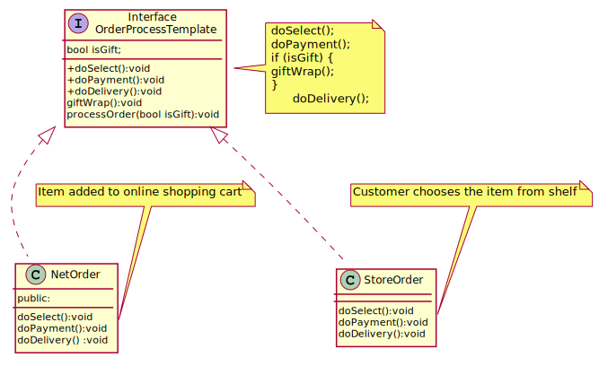

## Template Method

The Template Method defines a skeleton of an algorithm in an operation, and defers some steps to subclasses. Template Method lets subclasses redefine certain steps of that algorithm without changing the algorithm's structure.

[plantuml code](diagrams/order_process_template.puml)

**Strategy** is like Template Method except in its granularity.
Template Method uses inheritance to vary part of an algorithm. **Strategy** uses delegation to vary the entire algorithm.
Strategy modifies the logic of individual objects. Template Method modifies the logic of an entire class.
**Factory Method** is a specialization of Template Method.

Source code examples:
[template method](TemplateMethod/template_method.cpp), [template method order](TemplateMethod/template_method_order.cpp)

