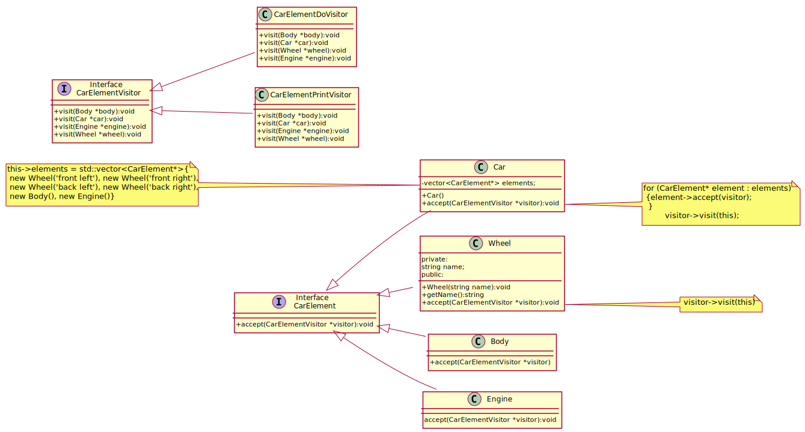

## Visitor

The **Visitor** design pattern is a behavioral pattern that enables operations to be performed on elements of an object structure **without modifying their classes**. It achieves this by **separating algorithms from the object structure**, allowing new operations to be added without changing the existing class hierarchy. Visitor implements **double dispatch**.

### Designing a Vehicle Inspection System

Imagine you are developing a **smart vehicle inspection system** that mechanics and car service providers can use to analyze different car components—wheels, body, and engine. Instead of modifying each car part's code every time a new inspection method is introduced, you want a flexible design where new operations (like checking for damage, printing reports, or applying maintenance tasks) can be added **without changing the core car structure**.  

---

The following UML describes a `Car` structure where different parts (`Wheel`, `Body`, `Engine`) **accept** visitors implementing operations such as printing details (`CarElementPrintVisitor`) or performing maintenance (`CarElementDoVisitor`).

This pattern is useful when operations **change more frequently** than the object structure, ensuring **better maintainability** and **extensibility** in C++ applications.

#### Key Components:
1. **Visitor Interface (`CarElementVisitor`)** – Declares visit methods for different element types.
2. **Concrete Visitors (`CarElementDoVisitor`, `CarElementPrintVisitor`)** – Implement specific behaviors for each element type.
3. **Element Interface (`CarElement`)** – Declares an `accept` method that takes a visitor.
4. **Concrete Elements (`Wheel`, `Body`, `Engine`, `Car`)** – Implement `accept` by calling `visitor->visit(this)`.
5. **Object Structure (`Car`)** – Contains elements and provides a way to iterate over them.

[plantuml code](diagrams/car_visitor.puml)

### **What's Happening in Our Code? What Are We Achieving?**  
Our software models a **car as a collection of parts** (`Wheel`, `Body`, `Engine`), where each part can be visited by different **inspection or action handlers** (visitors).  
- A **Print Visitor** (`CarElementPrintVisitor`) logs the details of each part.  
- A **Maintenance Visitor** (`CarElementDoVisitor`) performs specific actions on each part (e.g., kicking the wheels to check stability, starting the engine, moving the body).  
- New visitors (like a **Damage Assessment Visitor** or a **Cost Estimator Visitor**) can be easily added in the future without modifying the core car structure.  

This approach ensures **extensibility and maintainability** in our car inspection system.  

---

### **How It Works**  
1. **Car Components (`CarElement`) Are Defined**  
   - `Wheel`, `Body`, `Engine`, and `Car` inherit from `CarElement`.  
   - Each component has an `accept` function, allowing visitors to interact with them.  

2. **Visitors Implement Operations on Components**  
   - `CarElementPrintVisitor` logs car part details.  
   - `CarElementDoVisitor` performs operations like checking the engine or kicking the wheels.  
   - Future visitors could **inspect tire pressure, detect rust, or estimate repair costs**.  

3. **Car Accepts a Visitor**  
   - When the `accept` function is called on `Car`, it loops through all its components and applies the visitor logic to each one.  

4. **Double Dispatch Ensures Correct Behavior**  
   - Each visitor **automatically detects the correct car part type** (e.g., `visit(Wheel)`, `visit(Engine)`), ensuring type-safe, structured operations.  

---

### **Key Benefits of This Approach**  

✅ **Extensibility** – Easily add new operations (visitors) without modifying car components.  
✅ **Separation of Concerns** – Keeps data (car parts) separate from behavior (inspection, logging, maintenance).  
✅ **Scalability** – New visitors can be added for different functionalities (e.g., AI-driven diagnostics, cost estimation).  
✅ **Reusability** – The same visitor pattern can be applied to other vehicle models (trucks, motorcycles, airplanes).  
✅ **Maintainability** – Modifications to operations don’t require changes to car parts, reducing risk of breaking existing code.  

---

### ✅When to Use the **Visitor** Pattern:
1. **When You Need to Perform Operations on a Complex Object Structure**  
   - If you have a hierarchical structure (e.g., a composite tree) where you need to apply multiple operations without modifying the structure.
   - Example: A `Car` consisting of `Wheel`, `Body`, and `Engine`, where each part requires multiple operations like printing or maintenance.

2. **When You Want to Add New Operations Without Modifying Existing Classes**  
   - If adding operations directly to element classes would violate **Open/Closed Principle** (OCP).
   - Example: You need to add logging, analytics, or transformation functions to elements without changing their class definitions.

3. **When You Need Double Dispatch**  
   - If operations depend on both the **type of visitor** and the **type of visited element**.
   - Example: Different visitors (`CarElementPrintVisitor`, `CarElementDoVisitor`) should behave differently for each part (`Wheel`, `Engine`).

---

### ❌When **NOT** to Use the Visitor Pattern:
1. **When the Object Structure Changes Frequently**  
   - If the set of elements (e.g., `Wheel`, `Body`, `Engine`) changes often, you will need to update **all visitors**, making maintenance difficult.
   - Example: If you're frequently adding/removing components in a CAD software system.

2. **When There’s No Need for Multiple Operations on the Same Object Structure**  
   - If you only need one operation, embedding it directly in the element class is simpler and avoids unnecessary complexity.

3. **When Type Safety is a Concern**  
   - In languages like C++, using `dynamic_cast` or type-checking mechanisms in visitors can introduce runtime overhead and potential safety issues.

---

### 🔗Related Patterns:
1. **Composite**  
   - Used when elements form a hierarchical structure (e.g., a `Car` is composed of `Wheels`, `Body`, and `Engine`).
   - The Visitor pattern works well with Composite by allowing traversal and operations on the structure.

2. **Iterator**  
   - Used to traverse elements in a collection.
   - Visitor can be combined with Iterator to apply operations while iterating over elements.

3. **Strategy**  
   - Defines interchangeable algorithms (like visitors) without modifying the structure.
   - The difference: Strategy focuses on **algorithm selection**, while Visitor focuses on **operation dispatch** based on element types.

4. **Interpreter**  
   - If the structure represents a language (e.g., an AST for parsing), Visitor can define operations like evaluation or optimization.

By considering these factors, you can decide if **Visitor** is the right choice for your application! 🚀

Source code examples: [car visitor](../../../DesignPatern/src/Behavioral/Visitor/car_visitor.cpp), [color visitor](../../../DesignPatern/src/Behavioral/Visitor/color_visitor.cpp), [shopping item_visitor](../../../DesignPatern/src/Behavioral/Visitor/shopping_item_visitor.cpp), [document visitor](../../../DesignPatern/src/Behavioral/Visitor/document_visitor.cpp), [file visitor](../../../DesignPatern/src/Behavioral/Visitor/file_visitor.cpp), [stock visitor](../../../DesignPatern/src/Behavioral/Visitor/stock_visitor.cpp), [expression printer](../../../DesignPatern/src/Behavioral/Visitor/expression_printer.cpp)
