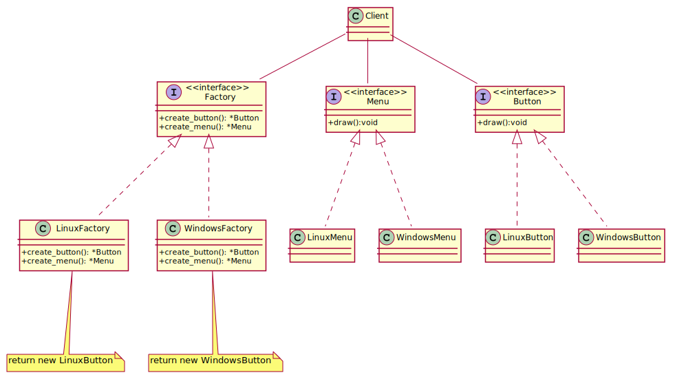

## AbstractFactory
Supporting new kinds of products is difficult. Extending abstract factories to
produce new kinds of Products isn't easy. That's because the AbstractFactory
interface fixes the set of products that can be created. Supporting new kinds of
products requires extending the factory interface, which involves changing the
AbstractFactory class and all of its subclasses. We discuss one solution to this
problem in the Implementation section.

AbstractFactory classes are often implemented with factory methods (Factory Method
(107)), but they can also be implemented using Prototype (117).
95A concrete factory is often a singleton (Singleton (127)).

[plantuml code](diagrams/abstract_factory.puml)

**Abstract Factory** has the factory object producing objects of several classes. 
**Builder** has the factory object building a complex product incrementally using a correspondingly complex protocol. 
**Prototype** has the factory object (aka prototype) building a product by copying a prototype object.
Abstract Factory can be used as an alternative to **Facade** to hide platform-specific classes.
Abstract Factory classes are often implemented with **Factory Methods**, but they can also be implemented using Prototype.

Abstract Factory classes are often implemented with Factory Methods, but they can also be implemented using Prototype.
Abstract Factory can be used as an alternative to Facade to hide platform-specific classes.

**Abstract Factory**  is similar to Builder in that it too may construct complex objects.
The primary difference is that the Builder pattern focuses on constructing a complex
object step by step. Abstract Factory's emphasis is on families of product objects (either
simple or complex). Builder returns the product as a final step, but as far as the Abstract
Factory pattern is concerned, the product gets returned immediately.

creat complex object and there is a dependency between them and you want to creat it step by step
step by step is the requiremenet and there is a depenedncy between those objects

You can construct objects step-by-step, defer construction steps or run steps recursively.
 You can reuse the same construction code when building various representations of products.
 Single Responsibility Principle. You can isolate complex construction code from the business logic of the product.

Many designs start by using Factory Method (less complicated and more customizable via subclasses) and evolve toward Abstract Factory, Prototype, or Builder (more flexible, but more complicated).

Builder focuses on constructing complex objects step by step. Abstract Factory specializes in creating families of related objects. Abstract Factory returns the product immediately, whereas Builder lets you run some additional construction steps before fetching the product.

You can use Builder when creating complex Composite trees because you can program its construction steps to work recursively.

You can combine Builder with Bridge: the director class plays the role of the abstraction, while different builders act as implementations.

Abstract Factories, Builders and Prototypes can all be implemented as Singletons.
