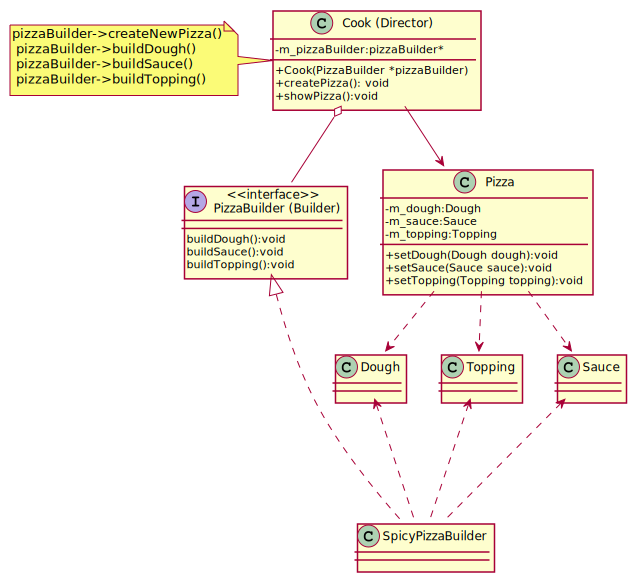

## Builder
Builder is a creational design pattern that lets you construct complex objects step by step. An application needs to create the elements of a complex aggregate. The Builder Creational Pattern is used to separate the construction of a complex.

Imagine a complex object that requires laborious, step-by-step initialization of many fields and nested objects. Such initialization code is usually buried inside a monstrous constructor with lots of parameters. 
In most cases most of the parameters will be unused, making the constructor calls pretty ugly.
The Builder pattern suggests that you extract the object construction code out of its own class and move it to separate objects called builders.
Builder provides control over steps of construction process.

[plantuml code](diagrams/pizza_builder.puml)

