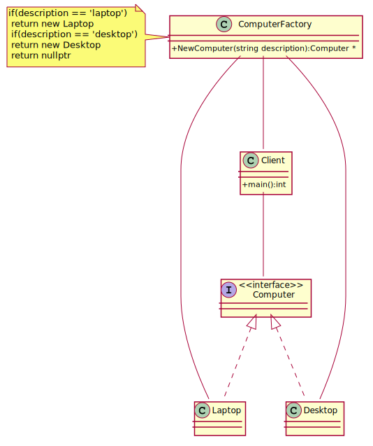

## Factory Method

Imagine programming a video game, where you would like to add new types of enemies in the future, each of which has different AI functions 
and can update differently. By using a factory method, the controller of the program can call to the factory to create the enemies, 
without any dependency or knowledge of the actual types of enemies.
 Now, future developers can create new enemies, with new AI controls and new drawing member functions, add it to the factory, and create a 
level which calls the factory, asking for the enemies by name. Combine this method with an XML description of levels, and developers could
 create new levels without having to recompile their program. All this, thanks to the separation of creation of objects from the usage of objects.
Factory Method defines an interface for creating an object, but let subclasses decide which class to instantiate. 

[plantuml code](diagrams/computer_factory_method.puml)

People often use Factory Method as the standard way to create objects. but it isn't necessary if: 
1) The class that's instantiated never changes.
2) Instantiation takes place in an operation that subclasses can easily override (such as an initialization operation).

**Factory Method** is similar to **Abstract Factory** but without the emphasis on families.
Factory Methods are routinely specified by an architectural framework, and then implemented by the user of the framework.

**Abstract Factory** classes are often implemented with **Factory Methods**, but they can be implemented using **Prototype** (class manufactures a new object or recycles an old one).
**Factory Methods** are usually called within **Template Methods**.
**Factory Method**: creation through inheritance. Factory Method requires subclassing, but doesn't require Initialize.
**Prototype**: creation through delegation. Prototype doesn't require subclassing, but it does require an Initialize operation.

