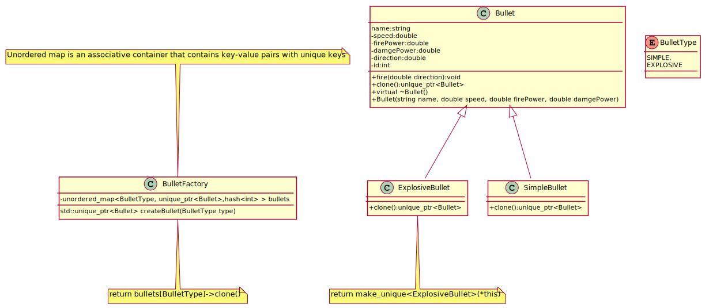

## Prototype
Prototype is a creational design pattern that lets you copy existing objects without making your code dependent on their classes.
If you want to copy object into an other one, you have to create a new object of the same class and then you have to go through 
all the fields of the original object and copy their values over to the new object but not all objects can be copied that way because some of the object’s fields may be private and not visible from outside of the object itself.

[plantuml code](diagrams/bullet_prototype.puml)

There are cases when either **Prototype** or **Abstract Factory** could be used properly. At other times they are complementary:
 Abstract Factory might store a set of Prototypes from which to clone and return product objects. **Abstract Factory**, **Builder**, and **Prototype** can use **Singleton** in their implementations.

Abstract Factory classes are often implemented with Factory Methods, but they can be implemented using **Prototype**.
Factory Method: creation through inheritance. Prototype: creation through delegation.
Often, designs start out using Factory Method (less complicated, more customizable, subclasses proliferate) and evolve toward Abstract Factory, Prototype, or Builder (more flexible, more complex) as the designer discovers where more flexibility is needed.
Prototype doesn't require subclassing, but it does require an "initialize" operation. Factory Method requires subclassing, but doesn't require Initialize.
Designs that make heavy use of the Composite and Decorator patterns often can benefit from Prototype as well.
Prototype co-opts one instance of a class for use as a breeder of all future instances.
Prototypes are useful when object initialization is expensive, and you anticipate few variations on the initialization parameters. In this context, Prototype can avoid expensive "creation from scratch", and support cheap cloning of a pre-initialized prototype.
Prototype is unique among the other creational patterns in that it doesn't require a class – only an object. Object-oriented languages like Self and Omega that do away with classes completely rely on prototypes for creating new objects.

