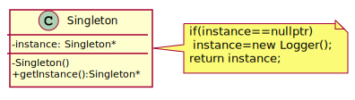

## Singleton

Singleton is a creational design pattern that lets you ensure that a class has only one instance, while providing a global access point to this instance.

[plantuml code](diagrams/singleton.puml)

Abstract Factory, Builder, and Prototype can use Singleton in their implementation.
Facade objects are often Singletons because only one Facade object is required.
State objects are often Singletons.
The advantage of Singleton over global variables is that you are absolutely sure of the number of instances when you use Singleton, and, you can change your mind and manage any number of instances.
The Singleton design pattern is one of the most inappropriately used patterns. Singletons are intended to be used when a class must have exactly one instance, no more, no less. Designers frequently use Singletons in a misguided attempt to replace global variables. A Singleton is, for intents and purposes, a global variable. The Singleton does not do away with the global; it merely renames it.
When is Singleton unnecessary? Short answer: most of the time. Long answer: when it's simpler to pass an object resource as a reference to the objects that need it, rather than letting objects access the resource globally. The real problem with Singletons is that they give you such a good excuse not to think carefully about the appropriate visibility of an object. Finding the right balance of exposure and protection for an object is critical for maintaining flexibility.
Our group had a bad habit of using global data, so I did a study group on Singleton. The next thing I know Singletons appeared everywhere and none of the problems related to global data went away. The answer to the global data question is not, "Make it a Singleton." The answer is, "Why in the hell are you using global data?" Changing the name doesn't change the problem. In fact, it may make it worse because it gives you the opportunity to say, "Well I'm not doing that, I'm doing this" – even though this and that are the same thing.

