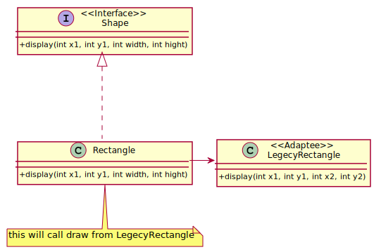

## Adapter

An "off the shelf" component offers compelling functionality that you would like to reuse, but its "view of the world" is not compatible with the philosophy and architecture of the system currently being developed.

Convert the interface of a class into another interface clients expect. Adapter lets classes work together that couldn't otherwise because of incompatible interfaces.
Wrap an existing class with a new interface.

[plantuml code](diagrams/adapter.puml)

**Adapter** makes things work after they're designed.
**Bridge** makes them work before they are.

**Adapter** provides a different interface to its subject. 
**Proxy** provides the same interface. Decorator provides an enhanced interface.

**Adapter** is meant to change the interface of an existing object. 
**Decorator** enhances another object without changing its interface. Decorator is thus more transparent to the application than an adapter is. 
As a consequence, Decorator supports recursive composition, which isn't possible with pure Adapters.

**Facade** defines a new interface, whereas **Adapter** reuses an old interface. Remember that Adapter makes two existing interfaces work together as opposed to defining an entirely new one.

