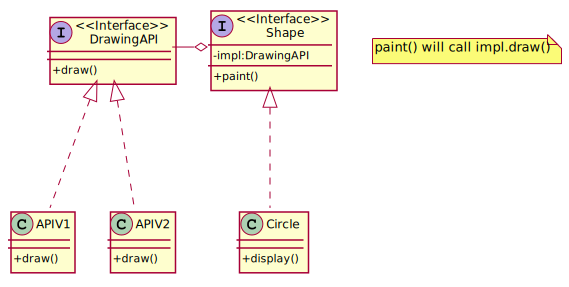

## Bridge

The Bridge Pattern is used to separate out the interface from its implementation. Doing this gives the flexibility so that both can vary independently.

Decompose the component's interface and implementation into orthogonal class hierarchies. The interface class contains a pointer to the abstract implementation class. This pointer is initialized with an instance of a concrete implementation class, but all subsequent interaction from the interface class to the implementation class is limited to the abstraction maintained in the implementation base class. The client interacts with the interface class, and it in turn "delegates" all requests to the implementation class.

The interface object is the "handle" known and used by the client; while the implementation object, or "body", is safely encapsulated to ensure that it may continue to evolve, or be entirely replaced (or shared at run-time.

Use the Bridge pattern when:

you want run-time binding of the implementation,
you have a proliferation of classes resulting from a coupled interface and numerous implementations,
you want to share an implementation among multiple objects,
you need to map orthogonal class hierarchies.
Consequences include:

decoupling the object's interface,
improved extensibility (you can extend (i.e. subclass) the abstraction and implementation hierarchies independently),
hiding details from clients.
Bridge is a synonym for the "handle/body" idiom. This is a design mechanism that encapsulates an implementation class inside of an interface class. The former is the body, and the latter is the handle. The handle is viewed by the user as the actual class, but the work is done in the body. "The handle/body class idiom may be used to decompose a complex abstraction into smaller, more manageable classes. The idiom may reflect the sharing of a single resource by multiple classes that control access to it (e.g. reference counting)."

[plantuml code](diagrams/bridge.puml)
