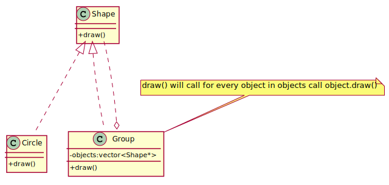

## Composite
Composite design pattern is to solve the problem representing "whole-part" hierarchical relationships. Compose objects into tree 
structures to represent whole-part hierarchies. Composite lets clients treat individual objects and compositions of objects uniformly. 

[plantuml code](diagrams/composite.puml)

**Composite** and **Decorator** have similar structure diagrams, reflecting the fact that both rely on recursive composition
 to organize an open-ended number of objects.

**Composite** can be traversed with **Iterator**. **Visitor** can apply an operation over a Composite. Composite could use **Chain of Responsibility** to let components access global properties through their parent. 
It could also use Decorator to override these properties on parts of the composition. It could use Observer to tie one object structure to 
another and State to let a component change its behavior as its state changes.
Composite can let you compose a **Mediator** out of smaller pieces through recursive composition.
Decorator is designed to let you add responsibilities to objects without subclassing. Composite's focus is not on embellishment but on representation.
These intents are distinct but complementary. Consequently, Composite and Decorator are often used in concert.

**Flyweight** is often combined with Composite to implement shared leaf nodes.

