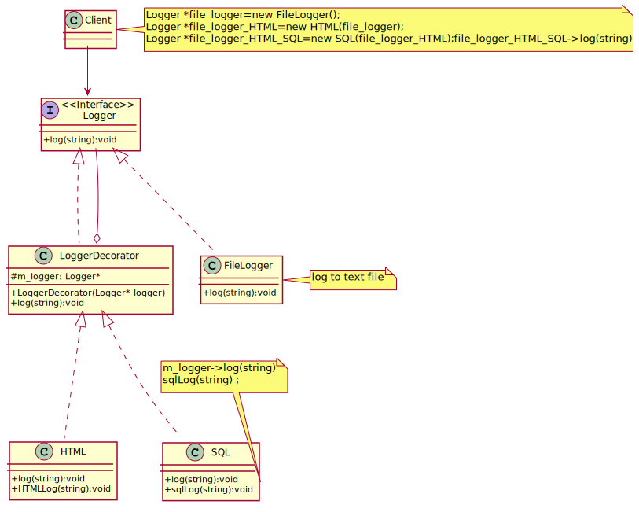

## Decorator
You want to add behavior or state to individual objects at run-time. Inheritance is not feasible because it is static and applies to an entire class
Decorator attach additional responsibilities to an object dynamically. Decorators provide a flexible alternative to subclassing for 
extending functionality.

[plantuml code](diagrams/decorator.puml)

Another good example use case of this pattern would be logger, where user might log events in multiple storages: 

[plantuml code](diagrams/logger_decorater.puml)

