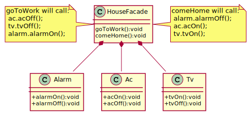

## Facade
Developers often use the facade design pattern when a system is very complex or difficult to understand because the system has many interdependent classes or because its source code is unavailable. This pattern hides the complexities of the larger system and provides a simpler interface to the client. 

[plantuml code](diagrams/facade.puml)

Remember that **Adapter** makes two existing interfaces work together as opposed to defining an entirely new one.

**Flyweight** shows how to make lots of little objects, Facade shows how to make a single object represent an entire subsystem.

