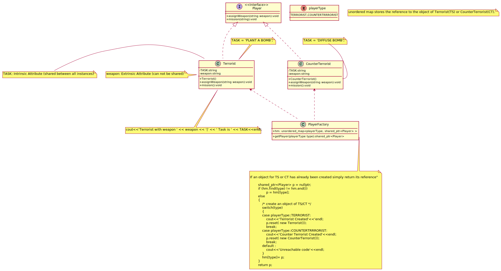

## Flyweight
The pattern for saving memory (basically) by sharing properties of objects. Imagine a huge number of similar 
objects which all have most of their properties the same. It is natural to move these properties out of these
 objects to some external data structure and provide each object with the link to that data structure.
 
The Flyweight stores a common state (also called intrinsic state) that belongs to multiple real entities. 
The Flyweight accepts the rest of the state (extrinsic state, unique for each entity) via its  method parameters. 
The Flyweight Factory creates and manages the Flyweight objects. It ensures  that flyweights are shared correctly. 
When the client requests a flyweight, the factory either returns an existing instance or creates a new one,
 if it  doesn't exist yet.

[plantuml code](diagrams/flyweight_counter_strike.puml)

**Prototype** Vs. **Flyweight**:
In Prototype objects' creation go through cloning, it ease object's creation. By making a request for cloning we create new cloned object each time.
In Flyweight by making a request we try to reuse as much objects as possible by sharing them. New required object will be created if we don't find such one. It's being done for resource optimization.

While in Prototype we could clone even one object, Flyweight pattern makes sense to use when in the application we use big number of objects.

You can implement shared leaf nodes of the **Composite** tree as **Flyweights** to save some RAM.

**Flyweight** shows how to make lots of little objects, whereas **Facade** shows how to make a single object that represents an entire subsystem.

**Flyweight** would resemble **Singleton** if you somehow managed to reduce all shared states of the objects to just one flyweight object. 
But there are two fundamental differences between these patterns:

1) There should be only one Singleton instance, whereas a Flyweight class can have multiple instances with different intrinsic states.
2) The Singleton object can be mutable. Flyweight objects are immutable.

