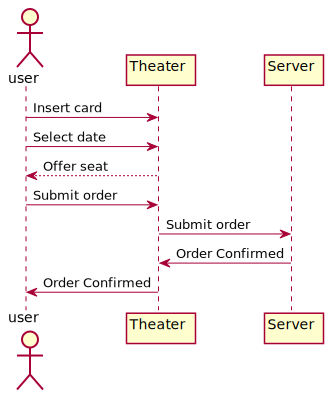

## Sequence Diagram
UML sequence diagram shows how objects in a system  or classes in the code interact with each other, in the order they take place and they show a sequence of events. The main purpose is to document processes and understand the requirement of a program.

1) **Actors** are always outside the scope of the system in a sequence diagram. 
2) **Objects** are represented by rectangles. Object that participate in the interaction are at the top of the diagram and you put the object that initiate the interaction in the left and place increasingly more subordinate objects to the right.
3) **Life line** is a vertical dash line that shows the existance of object over a period of time.
4) **Messeges** show the information being sent between objects (solid line). When and object a message back, this is called a return or reply message (dash line).
  -  **Synchronous messages**: A synchronous message waits for a reply before the interaction can move forward. The sender waits until the receiver has completed the processing of the message. The caller continues only when it knows that the receiver has processed the previous message i.e. it receives a reply message.
  -  **Asynchronous Messages**: An asynchronous message does not wait for a reply from the receiver. The interaction moves forward irrespective of the receiver processing the previous message or not. We use a lined arrow head to represent an asynchronous message.

[plantuml code](diagrams/TheaterServer..puml)

Refs:   [1](https://www.geeksforgeeks.org/unified-modeling-language-uml-sequence-diagrams/),
	[2](https://www.uml-diagrams.org/)

