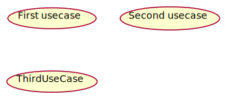
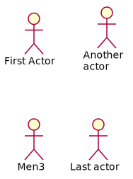

## Use Case Diagram

Use Case Diagrams are used to depict the functionality of a system or a part of a system.
They are widely used to illustrate the functional requirements of the system and its interaction 
with external agents(actors). A use case is basically a diagram representing different scenarios
 where the system can be used. A use case diagram gives us a high level view of what the system
 or a part of the system does without going into implementation details.
 
 
 
Use cases are a way to capture system functionality and requirements in UML. Use case
diagrams consist of named pieces of functionality (use cases ), the persons or things invoking
the functionality (actors ), and possibly the elements responsible for implementing the use
cases (subjects ).

### Use Cases
UML provides two ways to draw a use case. The first is
an oval with the name of the use case in the center

[plantuml code](diagrams/UseCases.puml)
UML recommends you use the classifier notation if you want to provide details
about a use case. Show the use case as a rectangle, with the use case oval in the top-right
corner.

### Actors
A use case must be initiated by someone or something outside the scope of the use case. This
interested party is called an actor. An actor doesn't need to be a human user; any external
system or element outside of the use case may trigger the use case. For example, it is very common to model
the system clock as an actor that triggers a use case at a given time or interval.

[plantuml code](diagrams/Actor.puml)

construct, and document systems. The Unified Modeling Language (UML) is one of those
languages. UML makes it possible for team members to collaborate by providing a common
language that applies to a multitude of different systems.

Ref Links:
	[1](https://www.uml-diagrams.org/use-case-diagrams.html),
    

