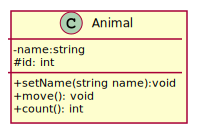
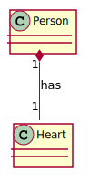
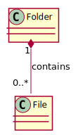
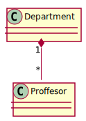
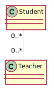
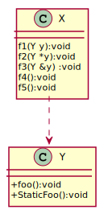
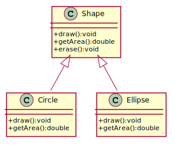
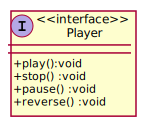
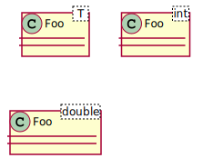

- [1. Class Diagram](#1-class-diagram)
    + [Introduction to UML Class Diagrams](#introduction-to-uml-class-diagrams)
    + [Member Visibility Notation in UML](#member-visibility-notation-in-uml)
- [2. Class Relationships](#2-class-relationships)
  * [2.1 Multiplicity in Relationships](#21-multiplicity-in-relationships)
  * [2.2 Composition (`Has-a`) `◆────────` <a id="composition"></a>](#22-composition---has-a----------------a-id--composition----a-)
    + [Example: Folder and Files](#example--folder-and-files)
  * [2.3 Aggregation (`Has-a, but weaker`) `◇────────` <a id="aggregation"></a>](#23-aggregation---has-a--but-weaker----------------a-id--aggregation----a-)
    + [Characteristics of Aggregation:](#characteristics-of-aggregation-)
    + [Example: Department and Professors](#example--department-and-professors)
  * [2.4 Association (`Knows-a, Uses-a`) `────────` <a id="association"></a>](#24-association---knows-a--uses-a---------------a-id--association----a-)
  * [2.5 Dependency (`Uses temporarily`) `- - - - - ->` <a id="dependency"></a>](#25-dependency---uses-temporarily-------------------a-id--dependency----a-)
  * [2.6 Inheritance (`Is-a`) `────────▷` <a id="inheritance"></a>](#26-inheritance---is-a----------------a-id--inheritance----a-)
  * [2.7 Realization (`Implements an Interface`) `- - - - - -▷` <a id="realization"></a>](#27-realization---implements-an-interface-------------------a-id--realization----a-)
  * [2.8 Class Template (`Generic Class`)](#28-class-template---generic-class--)
  * [3. Summary of Relationships](#3-summary-of-relationships)


---

# 1. Class Diagram

A **UML Class Diagram** is a structural diagram that represents the blueprint of a system by illustrating its **classes, attributes, methods, and relationships**. It is widely used in **object-oriented design** to model the **static structure** of software systems.

Each class in the diagram is depicted as a **rectangle** divided into three sections:
1. **Class Name** (for example, a `Car`)
2. **Attributes** (for example, `color: string`, `speed: int`)
3. **Methods** (for example, `startEngine()`, `brake()`)

Classes interact through different types of **relationships**, including:
- **Association**: A connection between two classes (`Driver` ↔ `Car`).
- **Inheritance (Generalization)**: A subclass inherits from a superclass (`ElectricCar` → `Car`).
- **Aggregation & Composition**: Whole-part relationships (`Library` contains `Books`).

Let's start with the following example: 

```cpp
class Animal
{
private:
    std::string name;
protected: 
    int id;
public:
    void setName(std::string name);
    virtual void move();
    static int count();
};
```


In UML, we typically represent a class using a rectangle divided into three sections:

1. **Class Name** (Top section)
2. **Attributes (Member Variables)** (Middle section)
3. **Methods (Member Functions)** (Bottom section)


The class diagram for the `Animal` class is shown below:



[PlantUML Code](diagrams/Animal.puml)


- **Access Specifiers:**
  - `-` (minus sign) → **Private** (e.g., `name`)
  - `#` (hash sign) → **Protected** (e.g., `id`)
  - `+` (plus sign) → **Public** (e.g., `setName()`, `move()`, `count()`)

- **Virtual Functions (`move()`):**
  - In UML, **virtual methods** are written in *italics* → `move(): void`
  
- **Static Methods (`count()`):**
  - In UML, **static methods** are **underlined** → `count(): int`

- **Protected** members are denoted with `#`


---

# 2. Class Relationships

So far, we have only dealt with classes containing primitive data types like `int`, `double`, and `std::string`. However, in real-world applications, classes often relate to other classes, forming different types of relationships such as inheritance or composition. 

The main types of relationships between classes are:

1. **Composition (Has-a)** `◆────────`
2. **Aggregation (Has-a, but weaker)** `◇────────`
3. **Association (Knows-a, Uses-a)** `────────`
4. **Dependency (Uses-a temporarily)** `- - - - - ->`
5. **Inheritance (Is-a)** `────────▷`
6. **Realization (Implements an Interface)** `- - - - - -▷`
7. **Class Template (Generic Type)**

---

## 2.1 Multiplicity in Relationships

Multiplicity defines how many instances of one class can be associated with an instance of another class:

1. `"0..1"` → Zero or one instance (optional)
2. `"1"` → Exactly one instance
3. `"0..*"` or `"*"` → Zero or more instances
4. `"1..*"` → At least one instance

---

## 2.2 Composition (`Has-a`) `◆────────` <a id="composition"></a>

In real-world scenarios, complex objects are composed of smaller parts. For example, a car consists of an engine, tires, and a transmission. In C++, when you define a class, it can contain members of other classes, forming a **composition**.

Composition is a **strong relationship** where:
1. The contained object is an essential part of the container.
2. The contained object can only belong to one container at a time.
3. The container manages the lifecycle of the contained object.
4. The contained object has no independent existence outside the container.

1. **`Circle`** and **`Point`**  
A `Circle` has a `Point` representing its center.

```cpp
class Point
{
};

class Circle
{
private:
    Point center;
};
```


2. **`Person`** and their **`Heart`**
Another example is the relationship between a `Person` and their `Heart`. The `Heart` exists only as part of the `Person`:

```cpp
class Heart
{
};

class Person
{
private:
    Heart heart;
};
```



[PlantUML Code](diagrams/PersonHeart.puml)


3. **Folder and Files**

A folder contains multiple files, and if the folder is deleted, all files inside it are deleted too.

- Each `File` **must** be associated with a `Folder` when it is created.
- A `Folder` can have **0 or more** `File` objects.


```cpp
class Folder; // Forward declaration

class File {
public:
    explicit File(Folder& parent) : parentFolder(parent) {} // Enforce 1-to-1 relationship

private:
    Folder& parentFolder; // Each File belongs to exactly one Folder
};

class Folder {
public:
    std::vector<File> files; // 0..* composition
};
```



[PlantUML Code](diagrams/FolderFile.puml)

---

## 2.3 Aggregation (`Has-a, but weaker`) `◇────────` <a id="aggregation"></a>

Aggregation is similar to composition but weaker. The key difference is that the contained object **can exist independently** of the container. 

### Characteristics of Aggregation:
1. The contained object **can belong to multiple containers**.
2. The container **does not manage** the lifecycle of the contained object.
3. The contained object **can exist independently**.

### Example: Department and Professors

A `Department` has a `Professor`, but the `Professor` can exist independently of the `Department`.

```cpp
class Professor
{
private:
    std::string name;
public:
    Professor(std::string name) : name(name) { }
    std::string getName() { return name; }
};

class Department
{
private:
    Professor *professor; 
public:
    Department(Professor *professor = nullptr) : professor(professor) {}
};
```



[PlantUML Code](diagrams/ProffesorDepartment.puml)

---

## 2.4 Association (`Knows-a, Uses-a`) `────────` <a id="association"></a>

In an **association**, two objects have a relationship, but neither controls the other’s lifecycle. For example, a **Teacher** and a **Student** have an association: a teacher teaches multiple students, and a student learns from multiple teachers.

```cpp
class Student;

class Teacher
{
private:
    std::vector<std::reference_wrapper<const Student>> students;
public:
    void addStudent(Student& student);
};

class Student
{
private:
    std::vector<std::reference_wrapper<const Teacher>> teachers;
public:
    void addTeacher(const Teacher& teacher)
    {
        teachers.push_back(teacher);
    }
};
```



[PlantUML Code](diagrams/StudentTeacher.puml)

---

## 2.5 Dependency (`Uses temporarily`) `- - - - - ->` <a id="dependency"></a>

A **dependency** (`---->`) occurs when a class **temporarily** depends on another class. The dependent class uses the other class as a **function parameter** or **local variable**, but does not store it as a member.

```cpp
class Y
{
public:
    void foo(){}
    static void StaticFoo(){}
};

class X 
{
    void f1(Y y)  { y.foo(); }
    void f2(Y* y) { y->foo(); }
    void f3(Y& y) { y.foo(); }
    void f4()     { Y y; y.foo(); }
    void f5()     { Y::StaticFoo(); }
};
```


In the example, `X` depends on `Y` in several ways:
1. **`f1(Y y)`**: `Y` is passed by value as a parameter.
2. **`f2(Y* y)`**: `Y` is passed as a pointer parameter.
3. **`f3(Y& y)`**: `Y` is passed as a reference parameter.
4. **`f4()`**: `Y` is created as a local variable.
5. **`f5()`**: `X` calls a static method of `Y`.

In all these cases, `X` depends on `Y` temporarily, but `Y` is not stored as a member of `X`. This is a classic example of a **dependency relationship**.


### Key Points:
1. **Dependency Arrow (`..>`)**:
   - The dashed arrow (`..>`) indicates a dependency relationship.
   - It points from the dependent class (`X`) to the class it depends on (`Y`).

2. **Temporary Usage**:
   - `X` uses `Y` temporarily in its methods (as parameters, local variables, or static method calls), but `Y` is not a member of `X`.

3. **No Ownership**:
   - `X` does not own or manage the lifecycle of `Y`. The dependency is short-lived and limited to the scope of the methods.




[PlantUML Code](diagrams/XDependsOnY.puml)

---

## 2.6 Inheritance (`Is-a`) `────────▷` <a id="inheritance"></a>

Inheritance represents an **"is-a"** relationship, where a subclass inherits properties and behaviors from a base class.

```cpp
class Shape
{
public:
    virtual void draw();
    virtual double getArea();
    void erase() {}  // Not virtual
};

class Circle : public Shape
{
    void draw() override {}
    double getArea() override {}
};

class Ellipse : public Shape
{
    void draw() override {}
    double getArea() override {}
};
```



[PlantUML Code](diagrams/ShapeCircleEllipse.puml)

---

## 2.7 Realization (`Implements an Interface`) `- - - - - -▷` <a id="realization"></a>

A **realization** relationship is used when a class **implements** an interface.

```cpp
class Player {
public:
    virtual void play() = 0;
    virtual void stop() = 0;
    virtual void pause() = 0;
    virtual void reverse() = 0;
};
```



[PlantUML Code](diagrams/PlayerInterface.puml)

---

## 2.8 Class Template (`Generic Class`)

A **class template** allows defining a class that can work with any data type.

```cpp
template <class T>
class Foo { T item; };

Foo<int> fooInt;
Foo<double> fooDouble;
```



[PlantUML Code](diagrams/Template.puml)

---

## 3. Summary of Relationships

1. **Composition** (`Has-a, owns`): Strong relationship; contained object is destroyed with the container.
2. **Aggregation** (`Has-a, but weaker`): Weak relationship; contained object can exist independently.
3. **Association** (`Knows-a`): Objects are related but don’t manage each other’s lifecycle.
4. **Dependency** (`Uses-a temporarily`): Short-term relationship via function parameters.
5. **Inheritance** (`Is-a`): A subclass inherits properties from a base class.


Refs:   [1](https://cppcodetips.wordpress.com/2013/12/23/uml-class-diagram-explained-with-c-samples/), 
	[2](https://www.learncpp.com/cpp-tutorial/10-1-object-relationships/), 
	[3](https://www.wikiwand.com/en/Class_diagram),
	[4](https://www.uml-diagrams.org/),
	[5](https://www.visual-paradigm.com/guide/uml-unified-modeling-language/uml-class-diagram-tutorial/),
	[6](https://www.ibm.com/support/knowledgecenter/SS8PJ7_9.7.0/com.ibm.xtools.modeler.doc/topics/cdepend.html)
	[7](http://www.cs.sjsu.edu/~pearce/modules/lectures/oop/basics/interfaces.htm)
	[8](https://martinfowler.com/bliki/BallAndSocket.html)

