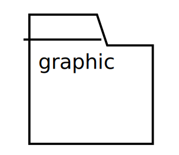
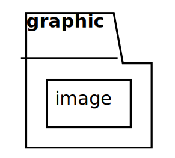
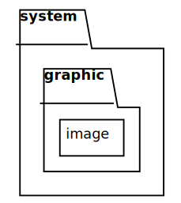
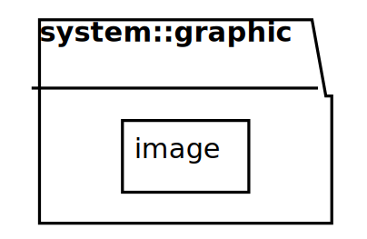
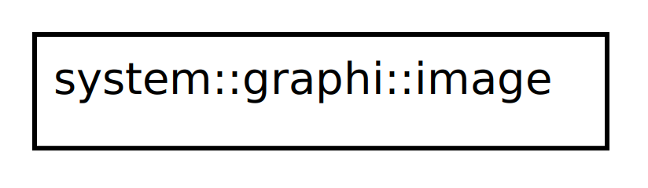

## Package Diagram

Classes represent the fundamental structur of an object-oriented system. In spite of the fact that they are 
superbly helpful, you need something more to structure enormous frameworks, which may have hundreds 
of classes. Package is a grouping construct that enables you to take any construct in the UML and 
gathering its components. Its most common use is to group classes, but you can use packages for every other bit of the UML.
as well.
Packages can also be members of other packages, so you are left with a hierarchic structure in which top-level packages.
 A package can contain both subpackages and classes. In C++ programming terms, packages correspond to namespaces.
Each class must have a unique name within its owning package. If you two class with same name  in the system use **fully qualified name** to distinguish them, for instance `system::disk::image` and `system::graphic::image`

[plantuml code](diagrams/Graphic.puml)

Contest diagra min box

[plantuml code](diagrams/GraphicImage.puml)

Nested pakages:

[plantuml code](diagrams/SystemGraphicImage.puml)

Fully qualified package name:

[plantuml code](diagrams/FullyQualifiedPackage.puml)

Fully qualified class name:

[plantuml code](diagrams/FullyQualifiedClass.puml)

A useful technique here is to reduce the interface of the package by exporting only a small subset of
the operations associated with the package's public classes. You can do this by giving all classes
private visibility, so that they can be seen only by other classes in the same package, and by adding
extra public classes for the public behavior. These extra classes, called **Facades** [Gang of Four], then
delegate public operations to their shyer companions in the package.

### Packages and Dependencies

Refs:
	[1](http://www.cs.sjsu.edu/~pearce/modules/lectures/uml/class/association)

